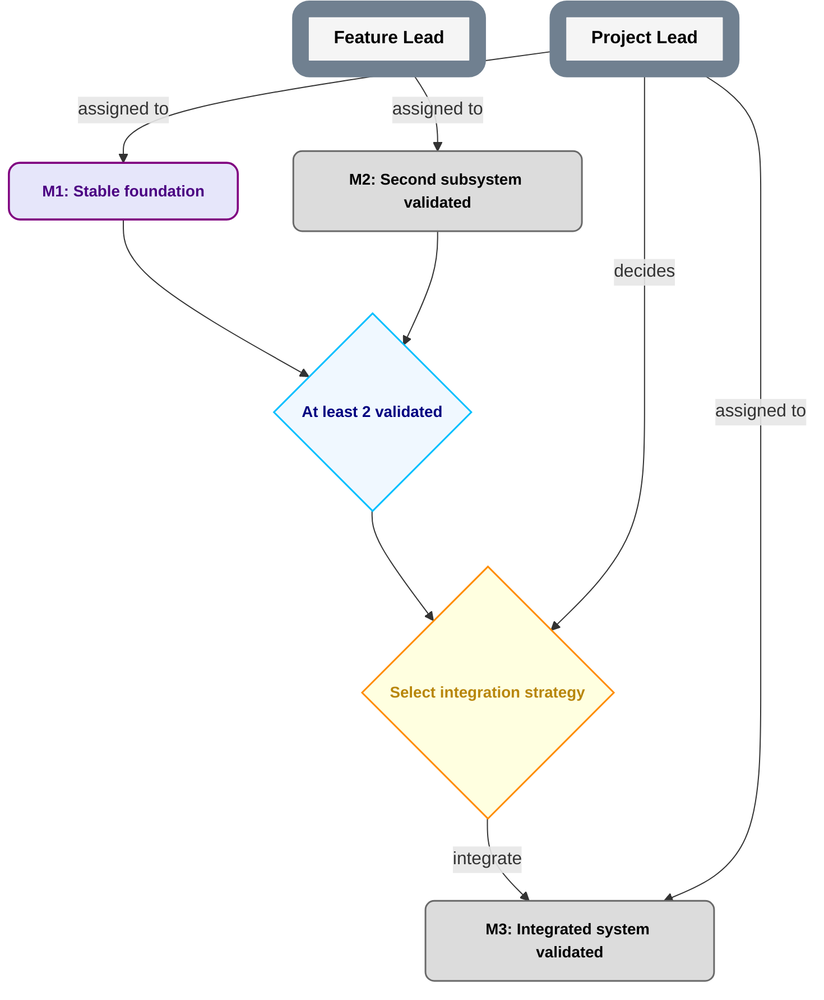

# Nested Planning Template

A repository-native planning system for AI-heavy projects that need clear authority, recursive delegation, visual roadmaps, durable current-state discovery, and low-overhead execution coordination.

Core idea:

> **Plans describe outcomes and dependencies. Roles hold authority. Holders temporarily occupy roles. Delegation can narrow authority downward, but never widen it. Parent plans own contracts; child plans own implementation inside those contracts.**

Planning topology and coordination topology are independent: a child plan may have its own Foreman, share a Foreman holder with another plan, or use another bounded coordination arrangement without changing substantive authority.

## What this solves

Use this template when you want to avoid:

- chats/agents silently acquiring authority because they have context or tools;
- plans becoming ambiguous prose;
- unreadable top-level diagrams;
- child plans weakening parent requirements;
- Role names being confused with current holders;
- nominally separate Roles being mistaken for independent review;
- current planning state being inferred from the newest branch head;
- a root project needing a fictional pre-existing Role;
- a rewritten publication ref silently reviving revoked authority;
- accepted exact PlanRefs disappearing after branch cleanup/rebase;
- stale notifications reapplying superseded work instructions.

## Repository layout

```text
AGENTS.md
README.md
planning/
  PLAN.md
  CONVENTIONS.md
  NESTING.md
  ROLES.md
  PUBLICATION.md
  PUBLICATION_TRANSITIONS.md
  PARENT.md
prompts/
  FOREMAN.md
templates/
  PLAN.md
  ROLES.md
  CHILD_PLAN.md
  CHILD_ROLES.md
  WORK_PACKAGE.md
  PLAN_CHANGE.md
  PARENT_CONTRACT.md
  ROLE_DELEGATION.md
  MILESTONE_ACCEPTANCE.md
  CURRENT.md
  FOUNDING.md
  PUBLICATION_EVENT.md
examples/
  robot-plan/
  child-project/
```

The template source is not itself an instantiated operational plan. Instantiated projects additionally create the required publication/founding records under `planning/PUBLICATION.md`.

## Current grammar

The current roadmap grammar is **`plan-grammar-v2`**.

v2 keeps Milestone delivery/evidence, Milestone acceptance, and roadmap projection separate. A Milestone-source hard prerequisite opens only when the current accepted PlanRef projects the Milestone `MILESTONE_DONE` and indexes its durable acceptance record.

Historical v1 plans remain v1; do not silently reinterpret them.

## Required concepts

### Role

A **Role** is a stable authority/responsibility slot, not a person, chat, model, or process. A holder may occupy multiple Roles. Rebinding a holder does not itself change Role scope.

### Milestone

A **Milestone** is an outcome with acceptance criteria. Milestones describe what becomes true, not an activity such as `review X`.

### Gate

A **Gate** is an objective predicate. No Role decides a Gate.

### Decision

A **Decision** requires judgment and has exactly one final deciding Role under the accepted grammar.

### PlanRef

A **PlanRef** is an exact Git commit SHA naming one planning/authority snapshot.

An exact SHA proves content identity, not that the content is accepted/current or durably retained.

In an instantiated project, current accepted planning state is determined through the publication protocol below.

## Mermaid grammar at a glance



Solid arrows are hard prerequisites; dotted `preferred before` edges are scheduling preferences. OR/N-of-M logic requires an explicit Gate. See `planning/CONVENTIONS.md` for the exact grammar.

## Root bootstrap

A root project has no prior Role. NPT therefore permits one bounded external **Founding Authority** to establish the first accepted plan/Role/governance state.

The founding act pins:

- founding identity, trust basis, and bounded scope;
- exact first candidate planning state;
- initial Role/binding state;
- initial publication protocol/ref;
- trusted publication-journal contract;
- exact PlanRef-retention contract.

The founding exception expires after the first valid journaled publication. Any continuing founder authority must then exist as an ordinary Role/binding.

A child repository may instead bootstrap from accepted parent authority covering the same boundary/trust setup.

## Publishing current accepted planning state

`plan-publication-v1` deliberately separates candidate content, approval, retention, ref movement, trusted transition evidence, and current state.

```text
exact semantic candidate exists
    -> valid pre-existing authority approves that exact SHA
    -> exact candidate is durably retained for cold fetch
    -> successor publication carrier is prepared
    -> configured publication ref conditionally/non-force advances
    -> trusted append-only/tamper-evident journal commits the exact ref-update event
    -> only then is candidate the current accepted PlanRef
```

### Why both Git carriers and a journal?

Git ancestry proves content relationships, but a fresh clone cannot prove that a mutable ref was never previously advanced and later reset. NPT therefore requires a bootstrap-configured trusted publication journal that preserves committed publication events independently of the mutable ref.

Bare Git ancestry or local reflogs alone are insufficient for cold reconstruction.

### Retaining accepted PlanRefs

A carrier containing the text of a SHA does not keep that commit reachable. Before publication succeeds, every exact published PlanRef must have a durable cold-fetchable snapshot locator independent of ordinary work-branch cleanup, squash, or rebase.

### Normal transition

A normal successor carrier has the actual accepted incumbent carrier as both its Git parent and accepted predecessor. The publication ref advances conditionally/non-force from that exact commit. The trusted journal then records the exact successful old→new ref update and retained PlanRef.

### Invalid/uncommitted tip recovery

A bad/uncommitted carrier may exist at the actual publication-ref tip without becoming accepted state.

Recovery preserves it rather than rewriting history:

```text
actual Git parent of recovery carrier = actual bad/uncommitted tip
accepted predecessor              = last valid journaled carrier
```

The recovery is validated under the last accepted PlanRef's governance. The trusted journal records both identities and quarantines the invalid suffix as preserved but non-accepted history.

See `planning/PUBLICATION.md`, `planning/PUBLICATION_TRANSITIONS.md`, `templates/CURRENT.md`, and `templates/PUBLICATION_EVENT.md`.

## Downward nesting

A child plan owns internal decomposition only inside an accepted parent contract. It may not broaden scope, weaken parent acceptance criteria, alter parent dependencies, invent permissions, or modify contracts owned above it.

Create durable child planning only when it reduces real coordination complexity.

## Upward nesting and multiple repositories

The same contracts work upward across repositories. Parent/child authority is explicit through parent contracts/delegations and exact accepted publication state—not submodules, forks, copied trees, or repository ownership.

Repositories may keep independent Git histories.

## Foreman

`Foreman` is execution-orchestration infrastructure, not automatic substantive authority.

A qualified Foreman environment must be able to delegate, schedule real follow-ups, access canonical records, validate accepted publication state, and preserve/recover concurrent work state.

One holder may coordinate several project-scoped Foreman bindings, or nested plans may use separate Foreman holders. Coordination reach never merges substantive authority.

Foreman startup resolves current accepted state from the trusted publication journal, verifies retained PlanRefs, then reads the exact accepted planning snapshot. It does not choose the newest branch, newest message, or mutable ref payload by convenience.

Scheduled tasks are treated as execution-context-bound resources; succession must verify/recreate them rather than trusting old IDs.

See `prompts/FOREMAN.md`.

## Propagation

Published-change notifications are wake mechanisms, not authority.

Every notification binds the exact committed publication event/carrier. Foreman tracks the last applied event per relevant scope/package; duplicate, stale, skipped, and out-of-order notifications are reconciled in trusted journal order before transition-specific actions are applied.

## Starting a project

1. Copy/fork the template.
2. Create the initial roadmap and sparse project-specific Roles.
3. Decide root vs child bootstrap.
4. Configure founding/parent authority plus publication ref, trusted journal, and PlanRef-retention mechanism.
5. Prepare the exact first candidate.
6. Approve that exact candidate and trust configuration.
7. Retain the exact candidate under the configured snapshot contract.
8. Create the first publication carrier.
9. Establish the publication ref and commit the first trusted journal event.
10. Only then are the initial Roles—including Foreman—operational.
11. Use `templates/PLAN_CHANGE.md` for later semantic changes and the publication protocol to make them current.

## Authority rule that overrides convenience

A planning file is not a magic permission source.

A proposed edit cannot authorize its own approval. A child cannot create powers the parent never granted. Repository access, prompt reach, tool availability, branch freshness, or coordination convenience do not substitute for accepted authority.

If accepted authority, trusted publication-journal evidence, or retained exact planning snapshots are missing/contradictory, fail closed and escalate.

## Scope

NPT defines planning/delegation/publication mechanics. Projects still add their own safety, privacy, release, data-integrity, hardware, legal, and technical invariants.
