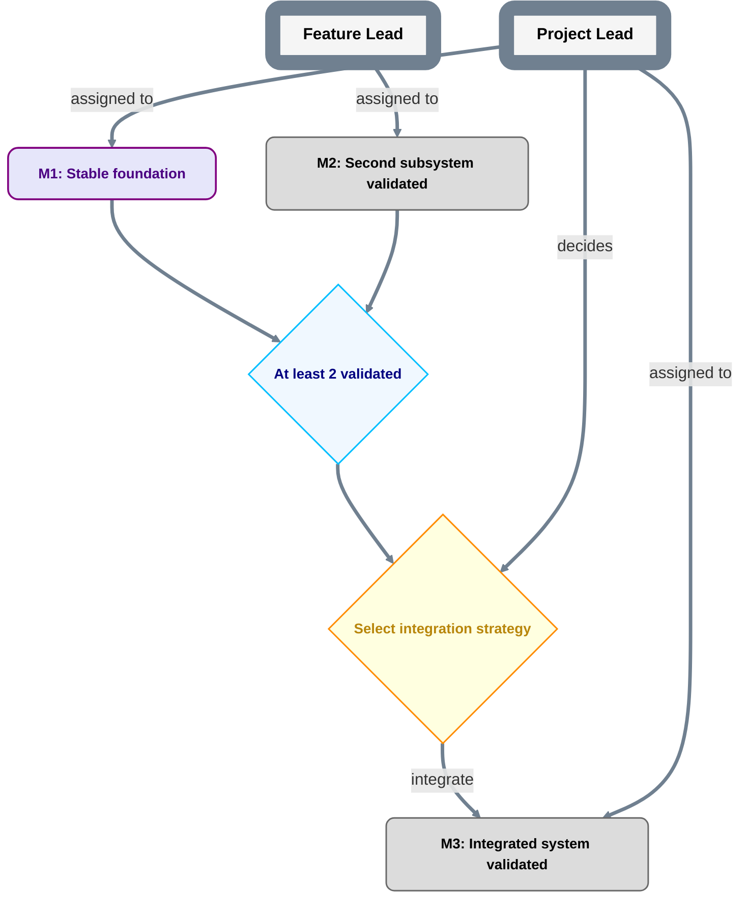

# Nested Planning Template

A repository-native planning system for AI-heavy projects that need clear authority, recursive delegation, visual roadmaps, and low-overhead execution coordination.

The system is designed so a project can be understood at a glance at one level, while allowing any sufficiently large milestone to become its own nested plan. The same mechanism also works upward: an entire repository can be one child milestone in a larger portfolio or super-project plan.

The core idea is simple:

> **Plans describe outcomes and dependencies. Roles hold authority. Holders temporarily occupy roles. Delegation can narrow authority downward, but never widen it. Parent plans own contracts; child plans own implementation inside those contracts.**

This repository is intentionally documentation-first. It does not require a planning service, database, workflow engine, or custom bot.

## What this solves

Use this template when you want to avoid common failure modes in AI-managed projects:

- chats or agents silently acquiring authority because they happen to have context;
- plans becoming prose that different agents interpret differently;
- top-level diagrams becoming unreadable as detail grows;
- subordinate leads creating incompatible planning conventions;
- a parent project needing to supervise every internal child-plan edit;
- plan changes failing to reach active workers;
- agents continuously polling for changes instead of receiving targeted updates;
- role names being confused with the person/chat currently holding them;
- multiple roles held by one agent being mistaken for independent review;
- child plans changing parent requirements or permissions without authorization;
- agents treating the newest branch head as accepted planning state without a durable acceptance/publication event;
- root projects needing to invent a fictional pre-existing Role to create their first real Role.

## Repository layout

```text
AGENTS.md
README.md
planning/
  PLAN.md
  CONVENTIONS.md
  NESTING.md
  ROLES.md
  PUBLICATION.md
  PARENT.md
prompts/
  FOREMAN.md
templates/
  PLAN.md
  ROLES.md
  CHILD_PLAN.md
  CHILD_ROLES.md
  WORK_PACKAGE.md
  PLAN_CHANGE.md
  PARENT_CONTRACT.md
  MILESTONE_ACCEPTANCE.md
  CURRENT.md
  FOUNDING.md
examples/
  robot-plan/
    PLAN.md
    PARENT_CONTRACT.md
  child-project/
    PLAN.md
    PARENT.md
```

`planning/PLAN.md` is the at-a-glance roadmap. `planning/CONVENTIONS.md` defines the exact planning grammar. `planning/NESTING.md` defines recursive delegation. `planning/ROLES.md` records role holders and authority. `planning/PUBLICATION.md` defines root bootstrap and how the current accepted PlanRef is published/discovered. `planning/PARENT.md` is used only when this repository itself is nested under another plan.

An instantiated project additionally creates `planning/CURRENT.md` from `templates/CURRENT.md`. A root project also creates `planning/FOUNDING.md` from `templates/FOUNDING.md` during first initialization.

## Current grammar version

The current contract is **`plan-grammar-v2`**.

v2 makes milestone delivery/evidence, milestone acceptance, and the roadmap projection of that acceptance separate facts. A milestone-source hard prerequisite becomes operational only when the current accepted PlanRef projects the milestone `MILESTONE_DONE` and indexes its durable acceptance record.

`plan-grammar-v1` remains a valid historical contract. Do not silently reinterpret v1 plans as v2. Cross-version child plans are treated according to `planning/NESTING.md`; absent an explicit compatibility rule, a v2 parent treats an unmigrated v1 child's internals as opaque and relies on the parent-facing boundary contract/evidence.

## Required concepts

### Role

A **Role** is a stable authority/responsibility slot. It is not a person, chat, model, account, or process.

A holder can occupy multiple roles. Rebinding a role to another holder does not change the role's scope. Two roles held by the same underlying agent do not create reviewer independence.

### Milestone

A **Milestone** is an outcome with acceptance criteria. Milestone labels describe what becomes true, not an activity such as `review X` or `work on Y`.

### Gate

A **Gate** is an objective predicate. No role decides a gate.

Examples:

- `At least 2 source foundations validated`
- `All required checks passed`

### Decision

A **Decision** requires judgment. Every Decision has exactly one role with a `decides` edge.

### PlanRef

A **PlanRef** is an exact Git commit SHA naming one planning/authority snapshot.

An exact SHA alone proves content identity, not that the content is accepted or current.

In an instantiated project, the **current accepted PlanRef** is the `plan_ref` named by the latest valid `planning/CURRENT.md` publication under `planning/PUBLICATION.md`.

Mutable branch names such as `main` are locators, not authority evidence. A newer default-branch commit may contain staged/unpublished planning changes and must not silently replace the published current PlanRef.

## Mermaid grammar at a glance



Do not invent new arrow meanings casually. If the grammar needs a new relationship, change `planning/CONVENTIONS.md` first.

## Root bootstrap

A root project has no parent Role that can authorize its first Role. Do not solve this by pretending repository ownership, write access, or a proposed Role is already authority.

Instead, `planning/PUBLICATION.md` defines one narrow bootstrap exception:

1. the project adopter explicitly designates an external **Founding Authority** and trust basis;
2. create `planning/FOUNDING.md` from `templates/FOUNDING.md`;
3. prepare the first candidate plan/Role state;
4. the Founding Authority approves that exact candidate;
5. publish the first `planning/CURRENT.md` record pointing to it;
6. the candidate becomes the first current accepted PlanRef;
7. the founding exception expires.

Any continuing authority of the founder must be represented by an ordinary Role/binding in that first accepted state.

A child project normally bootstraps instead from its accepted parent contract/delegation.

## Publishing the current accepted PlanRef

Plan publication is deliberately two-step.

```text
semantic planning content exists
    -> exact candidate PlanRef is identified
    -> already-valid authority approves that exact candidate
    -> planning/CURRENT.md publishes the approval
    -> candidate becomes current accepted PlanRef
```

The portable default permits the semantic candidate to be merged/staged before publication. That merge does **not** make it operative. `planning/CURRENT.md` remains authoritative until the new candidate is validly published.

A publication chains to the previous `publication_id` and `plan_ref`. If another publication wins first, the stale proposal must reconcile against the newer current state rather than using timestamps or merge order.

See `planning/PUBLICATION.md` and `templates/CURRENT.md`.

## Downward nesting

A lead may create a child plan only when its accepted role authority explicitly grants the required delegation capability.

Example:

```text
Top-level plan
  M1B: Glasses foundation
      child plan: GLASSES
        G1: Vendor connection validated
        G2: Durable capture validated
        G3: Diagnostics validated
        G4: Integrated glasses foundation accepted
```

The parent plan continues to show only `M1B`. The child plan contains the detailed graph.

The child may change its internal decomposition without changing the parent plan **only if the parent-facing contract is unchanged**.

A child may never use its own plan to:

- broaden its scope;
- weaken the parent milestone's acceptance criteria;
- alter parent-level dependencies;
- grant itself repository/device/data/spending authority;
- modify shared contracts owned above it;
- assign itself authority the parent never delegated.

See `planning/NESTING.md`.

## Upward nesting and multiple repositories

The same rules work upward.

A repository such as `robot-plan` can treat another repository as one child milestone:

```text
robot-plan
  R1: Robot hardware foundation
  R2: Learning subsystem ready
      child implementation -> another repository
  R3: Integrated robot validation
```

The parent repository stores a **parent contract** describing what the child must provide. The child repository stores `planning/PARENT.md` pointing back to the exact parent plan and milestone.

The repositories keep independent Git histories. Do not use Git submodules, copied source trees, or branch ancestry as the authority mechanism.

The parent normally changes only when the child boundary changes: child identity, parent-facing outcome, delegated authority, parent scheduling/dependency semantics, or parent milestone status. Internal child-plan edits do not require parent commits.

## The Foreman role

`Foreman` is the shared execution-orchestration role. It is not automatically the technical authority for the work it coordinates.

The Foreman holder **must** be a chat/agent environment capable of both:

1. delegating work to other agents/contexts; and
2. scheduling its own future follow-up tasks or checks.

Examples include ChatGPT Work-style conversations or another environment with equivalent delegation and scheduling capabilities.

Do **not** bind a plain chat that cannot schedule future work to the Foreman role. It may act as a worker or lead, but it cannot satisfy the Foreman contract.

Foreman uses scheduled follow-ups for work that depends on time or asynchronous external state, such as CI completion, independent review returns, release windows, or later checkpoints. Foreman does not continuously poll the plan. Plan propagation is event-driven with boundary checks.

The complete operating prompt is in `prompts/FOREMAN.md`.

## How plan changes propagate

Use **publication, then event-driven notification plus boundary checks**.

For a semantic plan/Role change:

1. resolve the current `planning/CURRENT.md` publication and prior PlanRef;
2. prepare/review the semantic change;
3. identify the exact resulting candidate PlanRef;
4. obtain approval of that exact candidate from authority that existed before the change;
5. publish the candidate through `planning/CURRENT.md` under `planning/PUBLICATION.md`;
6. only then does Foreman receive the new `publication_id`, PlanRef, semantic delta, affected roles/milestones, authority impact, and active-work impact;
7. Foreman reads that exact published revision;
8. Foreman routes only the relevant delta to affected role holders/work packages;
9. unaffected work continues;
10. new or materially revised work packages bind the newly published PlanRef.

Foreman also validates current publication state before:

- dispatching new substantive work;
- materially resuming paused work;
- final readiness/merge/acceptance handoffs whose validity depends on the plan.

Role holders do not need timer-driven polling.

## When to create a child plan

Create durable nesting only when it reduces complexity. Good reasons include:

- several meaningful parallel workstreams;
- multiple durable decision scopes;
- supervision burden too large for one lead;
- a milestone with its own nontrivial dependency graph;
- a stable subsystem that needs its own roadmap.

Do not create a durable role or child plan merely because another worker is useful. Temporary workers are cheap; durable authority structures should remain sparse.

## How to start a project from this template

1. Copy or fork this repository.
2. Replace `planning/PLAN.md` with your initial roadmap using only the defined grammar.
3. Define the initial Roles/holders in `planning/ROLES.md`.
4. Decide whether the repository is a root plan or child plan.
5. **Root:** explicitly designate the external Founding Authority and instantiate `planning/FOUNDING.md` from `templates/FOUNDING.md`.
6. **Child:** fill `planning/PARENT.md` and identify the accepted parent authority that permits child bootstrap.
7. Prepare the exact first candidate planning commit.
8. Obtain founding/parent approval of that exact candidate.
9. Instantiate `planning/CURRENT.md` from `templates/CURRENT.md` and publish the candidate under `planning/PUBLICATION.md`.
10. Only after that publication are the initial Roles—including Foreman—operational.
11. Bind a qualified Foreman holder if autonomous execution coordination is part of the accepted state.
12. Record the published PlanRef in substantive work packages.
13. Use `templates/PLAN_CHANGE.md` plus the publication protocol for later semantic changes.
14. Add child plans only when a delegated Role has the required capability.

## Authority rule that overrides convenience

A planning file is not a magic permission source.

A proposed edit cannot authorize its own approval. A child plan cannot create powers that the parent did not grant. Repository write access, seniority, chat history, tool availability, being the most informed agent, or being on the newest branch are not substitutes for accepted authority.

The only root bootstrap exception is the explicitly designated external Founding Authority defined by `planning/PUBLICATION.md`, and it expires after first valid publication.

When accepted records are missing, contradictory, ambiguous, or only proposed in an unmerged/unpublished change, treat authority as absent and escalate.

## Scope of this template

This template defines planning and delegation mechanics. It does not prescribe:

- a software-development methodology;
- a particular review count;
- a release process;
- a budgeting system;
- a specific AI provider;
- a requirement that every project use nested plans.

Projects should add domain-specific safety, data, release, legal, and technical invariants in their own `AGENTS.md` and durable contracts.
