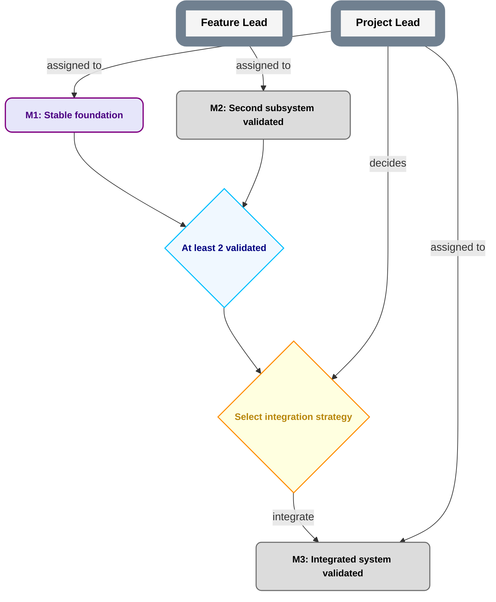

# Nested Planning Template

A repository-native planning system for AI-heavy projects that need clear authority, recursive delegation, visual roadmaps, durable current-state discovery, and low-overhead execution coordination.

Core idea:

> **Plans describe outcomes and dependencies. Roles hold authority. Holders temporarily occupy roles. Delegation can narrow authority downward, but never widen it. Parent plans own contracts; child plans own implementation inside those contracts.**

Planning topology and coordination topology are independent: a child plan may have its own Foreman, share a Foreman holder with another plan, or use another bounded coordination arrangement without changing substantive authority.

## What this solves

Use this template when you want to avoid:

- chats/agents silently acquiring authority because they have context or tools;
- plans becoming ambiguous prose;
- unreadable top-level diagrams;
- child plans weakening parent requirements;
- Role names being confused with current holders;
- nominally separate Roles being mistaken for independent review;
- current planning state being inferred from the newest branch head;
- a root project needing a fictional pre-existing Role;
- a rewritten publication ref silently reviving revoked authority;
- accepted exact PlanRefs disappearing after branch cleanup/rebase;
- accepted publication carriers disappearing after divergent recovery or garbage collection;
- stale notifications reapplying superseded work instructions.

## Repository layout

```text
AGENTS.md
README.md
planning/
  PLAN.md
  CONVENTIONS.md
  NODE_CONTRACTS.md
  NESTING.md
  REFERENCES.md
  ROLES.md
  PUBLICATION.md
  PUBLICATION_TRANSITIONS.md
  EXECUTION.md
  PARENT.md
prompts/
  FOREMAN.md
templates/
  PLAN.md
  ROLES.md
  CHILD_PLAN.md
  CHILD_ROLES.md
  WORK_PACKAGE.md
  EXECUTION_INVENTORY.md
  EXECUTION_RECEIPT.md
  PLAN_CHANGE.md
  PARENT_CONTRACT.md
  ROLE_DELEGATION.md
  MILESTONE_ACCEPTANCE.md
  DECISION.md
  DECISION_RESULT.md
  DATA.md
  DATA_RESOLUTION.md
  CURRENT.md
  FOUNDING.md
  PUBLICATION_EVENT.md
examples/
  robot-plan/
  child-project/
  execution/
  node-lifecycle/
  cross-plan/
```

The template source is not itself an instantiated operational plan. Instantiated projects additionally create the required publication/founding records under `planning/PUBLICATION.md` and configure/create the execution inventory under `planning/EXECUTION.md`.

## Current grammar

The current roadmap grammar is **`plan-grammar-v2`**.

v2 keeps Milestone delivery/evidence, Milestone acceptance, and roadmap projection separate. A Milestone-source hard prerequisite opens only when the current accepted PlanRef projects the Milestone `MILESTONE_DONE` and indexes its durable acceptance record.

Historical v1 plans remain v1; do not silently reinterpret them.

Decision and DATA semantics can explicitly adopt the separately versioned `decision-result-v1` and `data-dependency-v1` contracts. Their current accepted PlanRef indexes exact immutable records; the node contracts do not replace roadmap grammar v2. Legacy explicit semantics continue until an accepted migration. See `planning/NODE_CONTRACTS.md`.

`qualified-reference-v1` is a separately adopted reference contract, leaving v2 Mermaid syntax intact. It qualifies cross-plan objects by stable provider repository identity, repository-local PlanID, kind and local ID. Readable repository names/paths are locators; exact PlanRefs remain separate. Existing plans adopt and migrate through accepted publication, preserving historical meanings. See `planning/REFERENCES.md`.

## Required concepts

### Role

A **Role** is a stable authority/responsibility slot, not a person, chat, model, or process. A holder may occupy multiple Roles. Rebinding a holder does not itself change Role scope.

### Milestone

A **Milestone** is an outcome with acceptance criteria. Milestones describe what becomes true, not an activity such as `review X`.

### Gate

A **Gate** is an objective predicate. No Role decides a Gate.

### Decision

A **Decision** requires judgment and has exactly one final deciding Role under the accepted grammar.

Under `decision-result-v1`, an immutable result records exact definition/inputs, deciding authority and outcome selection. It opens only the selected branches after the accepted published PlanRef indexes it. Replacement/revocation preserves the old result and explicitly disposes affected branch work. Alternative branches rejoin through an explicit objective OR Gate.

### DATA

**DATA** is an artifact dependency with objective usability conditions. Under `data-dependency-v1`, an immutable resolution pins the exact artifact and the subject/input revisions it describes. The current accepted PlanRef selects that resolution, and its identity/usability must still match the consumer's use. Existence alone, a report for the wrong revision, or an unindexed replacement cannot satisfy it. Replacement/withdrawal changes the accepted index and preserves history; DATA has no acceptance receipt or DONE class.

See `examples/node-lifecycle/README.md` for Decision A→B replacement, DATA identity/replacement/withdrawal, and Milestone start/pause/resume/DONE/reopening. Non-DONE status changes use appropriate execution evidence; DONE requires valid acceptance/index; reopening preserves the prior immutable receipt.

### PlanRef

A **PlanRef** is an exact Git commit SHA naming one planning/authority snapshot.

An exact SHA proves content identity, not that the content is accepted/current or durably retained.

In an instantiated project, current accepted planning state is determined through the publication protocol below.

## Mermaid grammar at a glance



Solid arrows are hard prerequisites; dotted `preferred before` edges are scheduling preferences. OR/N-of-M logic requires an explicit Gate. See `planning/CONVENTIONS.md` for the exact grammar.

## Root bootstrap

A root project has no prior Role. NPT therefore permits one bounded external **Founding Authority** to establish the first accepted plan/Role/governance state.

The founding act pins:

- founding identity, trust basis, and bounded scope;
- exact first candidate planning state;
- initial Role/binding state;
- initial publication protocol/ref;
- trusted publication-journal contract;
- exact PlanRef-retention contract;
- exact publication-carrier-evidence retention contract.

The founding exception expires after the first valid journaled publication. Any continuing founder authority must then exist as an ordinary Role/binding.

A child repository may instead bootstrap from accepted parent authority covering the same boundary/trust setup.

## Publishing current accepted planning state

`plan-publication-v1` deliberately separates candidate content, approval, semantic retention, ref movement, carrier retention, trusted transition evidence, and current state.

```text
exact semantic candidate exists
    -> valid pre-existing authority approves that exact SHA
    -> exact candidate is durably retained for cold fetch
    -> successor publication carrier is prepared
    -> configured publication ref conditionally/non-force advances
    -> exact carrier and required recovery evidence are durably retained
    -> trusted append-only/tamper-evident journal commits the exact ref-update event
    -> only then is candidate the current accepted PlanRef
```

### Why both Git carriers and a journal?

Git ancestry proves content relationships, but a fresh clone cannot prove that a mutable ref was never previously advanced and later reset. NPT therefore requires a bootstrap-configured trusted publication journal that preserves committed publication events independently of the mutable ref.

Bare Git ancestry or local reflogs alone are insufficient for cold reconstruction.

### Retaining accepted PlanRefs

A carrier containing the text of a SHA does not keep that semantic commit reachable. Before publication succeeds, every exact published PlanRef must have a durable cold-fetchable snapshot locator independent of ordinary work-branch cleanup, squash, or rebase.

### Retaining accepted publication carriers

The journal also depends on historical publication carriers as evidence: their exact commit object, parent relation, tree, and `planning/CURRENT.md` content are used by later cold validation. A carrier SHA written into a journal event is not a reachability edge.

Therefore every accepted carrier must have durable cold-fetchable carrier evidence for at least the publication-journal lifetime. That evidence is independent of live-ref reachability and ordinary repository garbage collection.

For divergent recovery, NPT retains both:

- the displaced accepted carrier chain referenced by earlier accepted events; and
- the quarantined invalid/uncommitted suffix needed to validate what the recovery actually crossed.

### Normal transition

A normal successor carrier has the actual accepted incumbent carrier as both its Git parent and accepted predecessor. The publication ref advances conditionally/non-force from that exact commit. The exact successor carrier evidence is retained, then the trusted journal records the successful old→new ref update, retained PlanRef, and retained carrier evidence.

### Invalid/uncommitted tip recovery

A bad/uncommitted carrier may exist at the actual publication-ref tip without becoming accepted state.

Recovery preserves it rather than rewriting history:

```text
actual Git parent of recovery carrier = actual bad/uncommitted tip
accepted predecessor                  = last valid journaled carrier
```

The recovery is validated under the last accepted PlanRef's governance. Before its journal event commits, it retains the recovery carrier, the quarantined invalid suffix, and the separately retained displaced accepted predecessor evidence. The trusted journal then records both predecessor identities and all required evidence locators.

This allows the live graph to move onto a divergent recovery branch without making the prior accepted branch disappear from cold validation after garbage collection.

See `planning/PUBLICATION.md`, `planning/PUBLICATION_TRANSITIONS.md`, `templates/CURRENT.md`, and `templates/PUBLICATION_EVENT.md`.

## Downward nesting

A child plan owns internal decomposition only inside an accepted parent contract. It may not broaden scope, weaken parent acceptance criteria, alter parent dependencies, invent permissions, or modify contracts owned above it.

Create durable child planning only when it reduces real coordination complexity.

First publish the parent relationship under prior accepted parent authority, then publish the child pin to that exact relationship. The parent's authority baseline and the child's relationship pin have different meanings; neither requires its own containing commit SHA. See `planning/REFERENCES.md` and `examples/cross-plan/README.md` for finite same-repository and cross-repository sequences.

## Upward nesting and multiple repositories

The same contracts work upward across repositories. Parent/child authority is explicit through parent contracts/delegations and exact accepted publication state—not submodules, forks, copied trees, or repository ownership.

Repositories may keep independent Git histories.

## Foreman

`Foreman` is execution-orchestration infrastructure, not automatic substantive authority.

A qualified Foreman environment must be able to delegate, schedule real follow-ups, access canonical records, validate accepted publication state, and preserve/recover concurrent work state.

One holder may coordinate several project-scoped Foreman bindings, or nested plans may use separate Foreman holders. Coordination reach never merges substantive authority.

Foreman startup resolves current accepted state from the trusted publication journal, verifies retained PlanRefs and retained carrier/suffix evidence, then reads the exact accepted planning snapshot. It does not choose the newest branch, newest message, or mutable ref payload by convenience.

Scheduled tasks are treated as execution-context-bound resources; succession must verify/recreate them rather than trusting old IDs.

Foreman discovers packages, exact revisions/attempts, authorization, worker/return routes, material receipts, results and schedules from one configured durable execution inventory. It serializes dispatch claims and reconciles unknown sends/execution before replacing a worker. A successor resumes coordination of existing work; missing chat memory is not permission to redispatch it.

See `prompts/FOREMAN.md`, `planning/EXECUTION.md`, and `templates/EXECUTION_INVENTORY.md`.

## Work packages and temporary executors

Packages bind `target_type`/`target_id` to a Milestone, Decision, DATA node, or explicitly accepted maintenance scope. Decision research uses the Decision's own prerequisites and deciding Role; no downstream or dummy Milestone is required. These are work targets, not new roadmap node semantics.

A temporary worker validates an exact bounded authorization identifying its authorizing Role/current holder, executor context, permitted actions/tools, validity/stop conditions, and reserved decisions. It does not become the Role holder. The grant cannot accept Milestones, make reserved Decisions, bind Roles, or re-delegate substantive authority.

Use `templates/WORK_PACKAGE.md`. `planning/EXECUTION.md` includes explicit migration from legacy `milestone`-only packages: retain old records, revalidate authorization and existing attempts, and create a linked revision without speculative redispatch. Adopting this execution contract requires normal accepted publication; the roadmap and publication grammar retain their existing meanings.

## Propagation

Published-change notifications are wake mechanisms, not authority.

Every notification binds the exact committed publication event/carrier. Foreman tracks the last applied event per relevant scope/package; duplicate, stale, skipped, and out-of-order notifications are reconciled in trusted journal order before transition-specific actions are applied.

Material requests are durable before a wake is attempted. Sent, delivered, acknowledged, and applied are separate facts. A pause is **not confirmed stopped** until exact cessation/enforcement evidence accounts for in-flight work. Actual publication-reconciliation and receipt-recovery schedules catch lost wakes; bounded executor checkpoints restrict further execution when authority cannot be validated. Stronger lease/fencing behavior is a project policy.

Use `templates/EXECUTION_RECEIPT.md`. Direct messages, webhooks or polling can carry wakes; bare completion is not guaranteed notification. Verify schedule ownership/liveness on the actual substrate instead of inferring archive/delete cascades. See the bounded examples and recorded dogfooding qualifications in `examples/execution/CASES.md`.

## Starting a project

1. Copy/fork the template.
2. Create the initial roadmap and sparse project-specific Roles, and explicitly adopt/index any Decision/DATA node contracts and their initial empty or valid current records.
3. Decide root vs child bootstrap.
4. Configure founding/parent authority plus publication ref, trusted journal, PlanRef-retention mechanism, and carrier-evidence-retention mechanism.
5. Configure execution inventory location/serialization, reconciliation/receipt deadlines, escalation routes and bounded executor checkpoints under `planning/EXECUTION.md`; create the empty inventory and prepare the exact first candidate.
6. Approve that exact candidate and trust configuration.
7. Retain the exact candidate under the configured semantic snapshot contract.
8. Create and install the first publication carrier.
9. Retain the exact first carrier evidence under the configured carrier contract.
10. Commit the first trusted journal event.
11. Only then are the initial Roles—including Foreman—operational.
12. Use `templates/PLAN_CHANGE.md` for later semantic changes and the publication protocol to make them current.

## Authority rule that overrides convenience

A planning file is not a magic permission source.

A proposed edit cannot authorize its own approval. A child cannot create powers the parent never granted. Repository access, prompt reach, tool availability, branch freshness, or coordination convenience do not substitute for accepted authority.

If accepted authority, trusted publication-journal evidence, retained exact planning snapshots, or retained carrier/suffix evidence are missing/contradictory, fail closed and escalate.

## Scope

NPT defines planning/delegation/publication mechanics. Projects still add their own safety, privacy, release, data-integrity, hardware, legal, and technical invariants.
