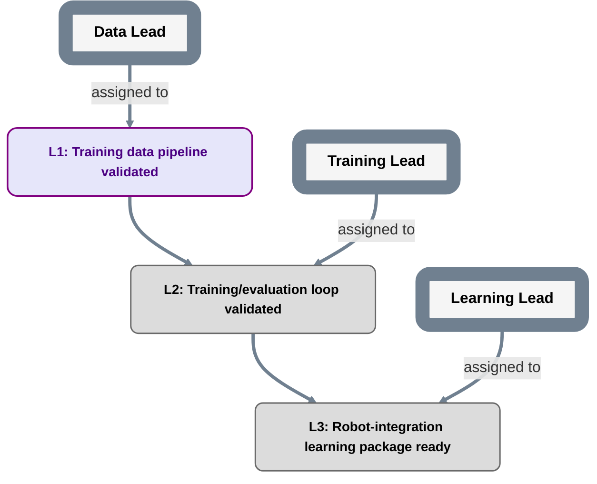

# Example: child learning-project roadmap

The repository IDs 1001/1002 and readable names are fictional examples, not verified live bindings. Operational adoption requires accepted publication and verified provider identities under `planning/REFERENCES.md`.

```text
plan_id: LEARNING
grammar: plan-grammar-v2
reference_contract: qualified-reference-v1
repository_identity: {"scheme": "github-repository-id-v1", "authority": "github.com", "id": "1002"}
repository_locator: example-owner/learning-project
parent_plan: {"repository_identity": {"scheme": "github-repository-id-v1", "authority": "github.com", "id": "1001"}, "plan_id": "ROBOT", "object_kind": "plan"}
parent_plan_navigation_locator: https://<host>/example-owner/robot-plan/blob/<navigation-ref>/planning/PLAN.md
parent_plan_ref: <P1: exact accepted parent relationship PlanRef>
parent_milestone: {"repository_identity": {"scheme": "github-repository-id-v1", "authority": "github.com", "id": "1001"}, "plan_id": "ROBOT", "object_kind": "milestone", "object_id": "R2"}
scope_owner_role: LearningLead
parent_contract: {"repository_identity": {"scheme": "github-repository-id-v1", "authority": "github.com", "id": "1001"}, "plan_id": "ROBOT", "object_kind": "contract", "object_id": "ROBOT-R2-LEARNING-v1"}
parent_contract_locator: examples/robot-plan/PARENT_CONTRACT.md
```

The parent navigation locator names the fictional external parent's specific `PLAN.md`. It is an unresolved, nonoperational placeholder: fill the host and navigation ref before use, keeping the visible link equal to that source. The fictional repository identity, accepted relationship pin and contract locator keep their separate meanings.

Source-tree documentation mirror only: [parent example page](../robot-plan/PLAN.md). This local copy is not the canonical parent navigation target.

↑ [Parent plan (unresolved external placeholder)](https://<host>/example-owner/robot-plan/blob/<navigation-ref>/planning/PLAN.md)



## Navigation

The parent link above the diagram exposes the external upward-navigation placeholder; it becomes usable only after the locator is filled. L1-L3 have no child/detail targets declared in this example, so there are no node rows yet.

The parent `robot-plan` sees only whether R2's parent contract is satisfied. It does not need to mirror L1-L3 or approve internal sequencing changes that preserve the contract.
