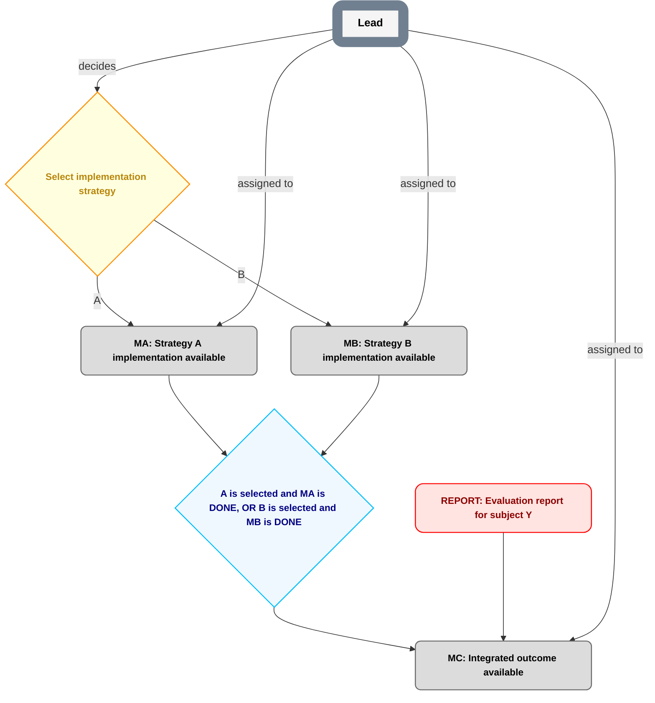

# Node lifecycle examples

These are fictional protocol walkthroughs, not an operational plan, live authorization, or acceptance. P0, P1 and similar labels abbreviate distinct exact accepted Git SHAs whose currentness and retained evidence have been validated under `planning/PUBLICATION.md`. Operational records use full exact identities and durable evidence, never these abbreviations.

## Decision branches and an explicit OR rejoin

The fictional P0 explicitly adopts `decision-result-v1` for D0, “Select implementation strategy,” with tokens `A` and `B`, cardinality `exactly_one`, and `active_result: none`. Lead is the unique deciding Role and has independent existing authority for that judgment. D0's own prerequisites/inputs are satisfied. Its input rule permits a fresh A/B comparison against fixed project constraints, with the actual evidence revisions pinned in each result. Each Milestone has its own authorized delivery/acceptance contract.

This diagram illustrates P0's topology. Its later class projections change only through accepted planning state. G's predicate is objective: read the exact active result and count the selected branch's operative DONE Milestone. G has no deciding Role. MC requires both G and REPORT because its two ordinary incoming prerequisites are AND.

The immutable selection R-A binds D0's exact definition/input PlanRef P0, exact evidence revisions I1, Lead's independently accepted authority/binding at issuance, issuer identity/time, `selected_outcomes: [A]`, `selection_cardinality: exactly_one`, and no predecessor. Its work-disposition record states no prior affected branch work with supporting evidence.

| Current accepted state / observed records | New A branch dispatch | New B branch dispatch | Meaning |
|---|---|---|---|
| P0: active result `none`, no result yet | Closed | Closed | A label alone does not choose a branch. |
| P0: R-A exists durably but is unindexed | Closed | Closed | Issuance is distinct from operative selection. |
| P1: active result R-A, last change R-A, history includes R-A | Open subject to MA's other prerequisites/authority | Closed | Only the exact indexed selection opens its token. P1 does not replace R-A's P0 contract binding. |
| P1: new immutable R-B exists but is unindexed | Unchanged | Closed | A newer result cannot win by timestamp. |
| P2: active result R-B, last change R-B, history retains R-A/R-B | Closed for new dispatch | Open subject to MB's other prerequisites/authority | R-B explicitly supersedes R-A and P2 deactivates R-A. |
| P3: active result `none`, last change REV-B, history retains all three | Closed | Closed | An indexed authorized revocation deactivates R-B without selecting A. |

R-B binds the compatible accepted D0 definition and exact I2 inputs under P1, current deciding authority/binding, `selected_outcomes: [B]`, `prior_result_change: R-A`, and `supersedes_result: R-A`. Its explicit disposition names active package `W-A` at revision X: `pause` under the independently authorized work-control source, preserve its artifacts/evidence, report remaining effects, and review affected downstream work before resumption. P2 includes that disposition; publishing it does not prove W-A physically stopped. A `continue` disposition would have to name bounded already-authorized W-A work and still would not open A for new dispatch.

REV-B is a new immutable revocation record naming `prior_result_change: R-B` and `revokes_result: R-B`, empty selected outcomes as a revocation, current authorized issuer, reason/evidence and the explicit B-work disposition. P3 sets the active index to none; it never edits R-A or R-B. A later selection needs a new record naming REV-B as its prior change; reindexing old R-A/R-B is not valid reactivation.

Suppose MA became DONE under P1, with a valid acceptance/index, before the change to B. Under P2, G is still **false** until MB is operative DONE: historical A completion cannot satisfy a predicate that expressly requires the currently selected outcome. After MB is DONE, G is true; MC may start only if REPORT is also usable and MC's authority is valid. Drawing MA -> MC and MB -> MC directly would demand both, not an OR rejoin.

Reject these counterexamples:

- Two selected tokens under `exactly_one`, duplicate/undeclared tokens, or a result issued by a Role other than the unique authorized decider.
- A competing R-C that fails to name the exact incumbent it replaces, or a replacement with unknown old-branch work disposition.
- Retargeting R-A to new input revisions or changing its question/cardinality in place.
- Reading a result from an uncommitted publication suffix, absent retained evidence, or a mutable branch instead of the current accepted index.
- A legacy v2 node silently treated as `decision-result-v1` without an accepted adoption; a reader guessing unsupported contract semantics.

These examples establish local activation rules, not a global branch-satisfiability algorithm or nested-plan mapping.

## DATA identity, usability, replacement and withdrawal

REPORT in the diagram explicitly adopts `data-dependency-v1`. Its accepted definition requires an evaluation report describing exact subject revision Y and input dataset Z; a report for X does not qualify. The artifact must have a pinned content digest and retrievable immutable locator. The objective predicate requires the declared report format, subject/input identity, and score at least 90. `availability_alone_suffices: no`.

Q-Y is an immutable usable resolution against the accepted DATA definition at P-D0. It names exact subject Y/dataset Z, report artifact digest H1 and locator, resolver identity/time, and retained evidence that each declared condition passed. It names no predecessor. The later indexing PlanRef P-D1 does not replace Q-Y's P-D0 contract binding.

| Current selection and observation | REPORT prerequisite | Reason |
|---|---|---|
| P-D0: no current resolution; no artifact | Unsatisfied | Nothing selected or available. |
| P-D0: report for X exists and scores 98 | Unsatisfied | Wrong required subject revision, despite availability and its own passing result. |
| P-D0: exact report for Y/Z passes and Q-Y exists but is unindexed | Unsatisfied | Usable evidence is not yet selected by current planning state. |
| P-D1: current resolution Q-Y; exact H1 report is available and conditions hold | Satisfied | Current selection, exact identity/subject/inputs and objective usability all match. |
| P-D1: same URL now serves a different digest | Unsatisfied | A locator cannot silently replace identity. |
| P-D1: H1 temporarily unavailable or a required validity predicate fails | Unsatisfied | The selected evidence is not usable now; no alternate record is implicitly selected. |
| P-D1: exact H1 is restored and all unchanged conditions hold | Satisfied | Selection stayed Q-Y; objective availability was rechecked, not replaced. |
| P-D1: better report H2 and Q-Y2 exist, unindexed | Q-Y remains the only eligible resolution | A new artifact/result does not replace the accepted selection. |
| P-D2: current resolution Q-Y2; Q-Y2 explicitly supersedes Q-Y; H2 for Y/Z passes | Satisfied through Q-Y2 | Accepted publication changes selection and retains the old exact resolution/history. |
| P-D3: current resolution `none`; last change WITHDRAW-Y2 names Q-Y2 | Unsatisfied | Explicit indexed withdrawal; old artifacts still existing do not reopen the dependency. |

Q-Y2 records its exact H2 identity, `prior_resolution_change: Q-Y`, and fresh predicate evidence against the compatible accepted definition. P-D2 includes disposition for each consumer of Q-Y: e.g. pause `W-INTEGRATE@C1` under its existing work-control authority, retain its consumed-H1 evidence, and authorize only bounded revalidation under new Q-Y2 before resumption. WITHDRAW-Y2 is a new immutable withdrawal record naming Q-Y2 as prior change and withdrawn resolution, with reason/evidence and consumer disposition; P-D3 clears the current index and preserves Q-Y/Q-Y2/withdrawal history. Renewal requires a new usable record naming this withdrawal and fresh current evidence, not silently reindexing Q-Y2.

If the required subject changes from Y to a different revision, first accept the changed definition and then resolve against it. Do not relabel the old H1 report as evidence for the new subject. If the requirement instead explicitly says availability alone suffices, the selected exact artifact must still exist for its required subject/inputs; there is still no Milestone acceptance. A judgment such as “this evaluation is persuasive enough” belongs in a Decision.

## Milestone execution, acceptance and reopening

M1 is an outcome owned for delivery by DeliveryLead. Its accepted contract independently names AcceptanceLead's acceptance authority. Planner has separate pre-existing permission to publish the relevant status changes. Example Role names do not confer authority.

| Observed event and accepted projection | Required evidence | Milestone-source prerequisite |
|---|---|---|
| P0 projects M1 `PENDING`; no work has begun | Accepted contract/assignment, acceptance index `none` | Closed. |
| Authorized package W1 starts; P1 later projects `INPROGRESS` | Exact W1 start event and existing execution/planning authority, no acceptance receipt | Closed. W1 starting does not itself publish P1. |
| W1 pauses; P2 projects `PENDING` | Exact authorized stop/pause or execution-state event supporting inactive state and accounting for remaining effects, no acceptance receipt | Closed. A sent stop alone cannot prove cessation. |
| Authorized W2 resumes; P3 projects `INPROGRESS` | Exact W2 resume event and its current authority, no acceptance receipt | Closed. |
| AcceptanceLead issues immutable receipt A1 judging P3's exact contract | Criteria-by-criteria accepted evidence and independent acceptance authority | Still closed while P3 projects INPROGRESS and indexes no receipt. |
| Planner publishes P4 projecting `DONE` and indexing A1 | A1 is valid for the applicable contract; ordinary publication proof establishes P4 | Open. P4 does not become A1's `contract_plan_ref`; that remains P3. |
| New evidence leads to authorized reopening decision R1; P5 projects `PENDING` | R1 names M1, P3/A1, invalidating evidence and work impact. Current acceptance index becomes `none`; history links preserve A1/R1 | Closed under P5. A1 and P4 remain unchanged history. |
| Authorized W3 starts; P6 projects `INPROGRESS` | R1 plus W3's current authorized execution event | Closed. No fabricated acceptance. |
| AcceptanceLead issues A2 satisfying current contract/evidence and R1's requirements; P7 projects `DONE` and indexes A2 | A2 is a new durable receipt; A1 is neither edited nor silently revived | Open under P7. |

Counterexamples:

- Reject a PENDING -> INPROGRESS update that manufactures an acceptance receipt despite incomplete criteria. Use the authorized start event.
- Reject INPROGRESS -> DONE based only on passing tests, a worker's `done`, or a status class. The exact valid acceptance/index is required.
- Reject a P4-style DONE projection that changes A1's `contract_plan_ref` from P3 to P4. The receipt judges its original contract.
- Reject reopening by rewriting/deleting A1 or silently clearing the index without the authorized reopening decision/history.
- A direct DONE -> INPROGRESS transition needs both the reopening decision and authorized resumed-execution evidence; reopening alone does not claim work started.
- A candidate projection is not current merely because it exists, merges, or has a new SHA. The publication journal/retained-evidence contract still governs.
