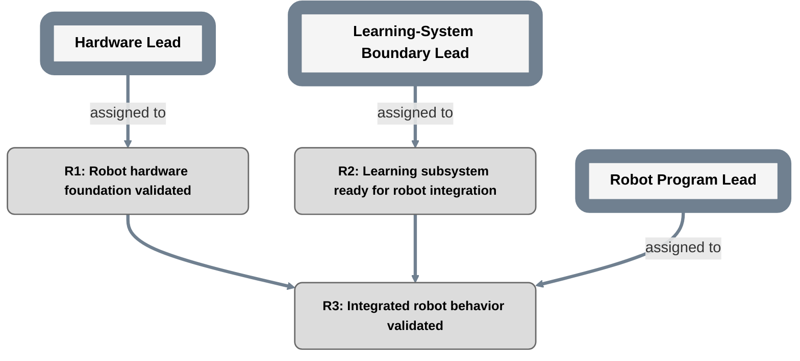

# Example: robot-plan parent roadmap

This is an example only. It demonstrates a parent repository treating another repository as one milestone.

```text
plan_id: ROBOT
grammar: plan-grammar-v2
```



## Child implementation binding for R2

```text
repository: example-owner/learning-project
plan_path: planning/PLAN.md
plan_id: LEARNING
scope_owner_role: LearningLead
parent_contract: examples/robot-plan/PARENT_CONTRACT.md
```

The parent does not need to mirror the child's internal milestones. It cares only whether R2's contract is met.
