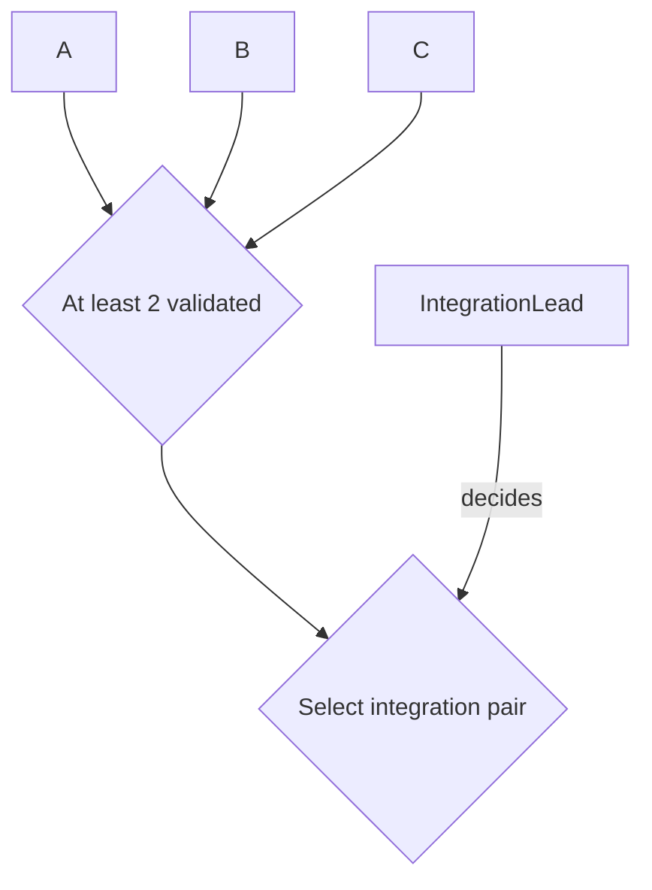

# Planning conventions

This file defines the exact current planning grammar: `plan-grammar-v2`. Agents must not infer alternate meanings from layout, color, prose tone, or prior chats.

## Grammar version

`plan-grammar-v2` is intentionally incompatible with `plan-grammar-v1` in milestone acceptance/lifecycle semantics. In v2:

- milestone delivery/evidence and milestone acceptance are separate facts;
- accepted milestones use durable acceptance records;
- milestone-source hard prerequisites become operational only when the current accepted PlanRef projects the milestone `MILESTONE_DONE` and indexes its acceptance;
- issued acceptance records are immutable historical receipts.

A historical v1 plan remains valid under v1. Do not silently reinterpret a v1 plan as v2 merely because it uses the same node names. Cross-version nesting and migration are defined in `NESTING.md`.

Decision and DATA nodes may explicitly adopt `decision-result-v1` and `data-dependency-v1` under `NODE_CONTRACTS.md`. These are separately versioned planning semantics, not a new roadmap grammar. The current accepted published PlanRef indexes their operative records; historical v2 nodes with other explicit contracts are not silently migrated.

## Canonical node classes

### ROLE
A stable authority/responsibility slot. Roles are not holders.

### MILESTONE
An outcome with explicit acceptance criteria. Status is encoded only by class:

- `MILESTONE_PENDING`
- `MILESTONE_INPROGRESS`
- `MILESTONE_DONE`

These classes describe the state projected by the **current accepted roadmap snapshot**. They are not instantaneous claims about every external event that may have occurred since that PlanRef was accepted.

Do not put status words into milestone labels.

A Milestone definition, work performed toward it, evidence about it, acceptance of it, and the roadmap's status projection are distinct facts. Assignment means responsibility for delivery; it does not by itself grant acceptance authority.

### GATE
An objective predicate. No Role decides a Gate.

### DECISION
A judgment call. Every Decision must have exactly one incoming `decides` edge from one Role.

### DATA
A concrete evidence/artifact dependency important enough to appear in the overview. Do not use DATA nodes for ordinary documentation.

## Edge grammar

### Hard prerequisite

```text
A --> B
```

Meaning: A must be accepted/satisfied before substantive execution of B begins.

Activation is node-type-specific:

- **Milestone source:** the prerequisite is operative only when the current accepted PlanRef projects that Milestone as `MILESTONE_DONE` and indexes the valid acceptance record that supports the projection. A visible external acceptance record alone does not open downstream dispatch while the current accepted roadmap still shows the Milestone unfinished.
- **Gate source:** the prerequisite is operative when the Gate's objective predicate is demonstrably true. No separate Gate-status or Gate-projection commit is required. If the Gate counts Milestones, it counts only Milestones operative as `MILESTONE_DONE` in the current accepted PlanRef.
- **Decision source:** under an explicitly adopted `decision-result-v1`, only the exact valid selection indexed by the current accepted PlanRef opens its selected outcome edges; no indexed result means no branch. Other prerequisites still apply. See `NODE_CONTRACTS.md`.
- **DATA source:** under an explicitly adopted `data-dependency-v1`, the current accepted PlanRef must index the exact resolution, and its artifact identity/subject/inputs/objective usability must match this use. Missing, wrong-revision or unusable evidence does not satisfy the dependency. See `NODE_CONTRACTS.md`.

For historical nodes with other explicitly accepted contracts, use their declared semantics until an accepted migration. Missing/unsupported contract semantics fail closed for the affected dependency. Neither Decision nor DATA acquires a Milestone DONE class or acceptance receipt.

For ordinary nodes, multiple hard incoming edges mean **AND**.

Any OR, N-of-M, threshold, or other non-AND condition requires an explicit GATE.

### Scheduling preference

```text
A -. "preferred before" .-> B
```

Meaning: B may proceed without A, but absent a specific reason otherwise, Foreman should schedule A first.

This is the only dotted scheduling phrase in the overview grammar. Do not substitute `helpful before`, `nonblocking`, `quality feedback`, `ideally before`, or similar wording.

### Role assignment

```text
Role -- "assigned to" --> Milestone
```

Meaning: the Role has primary responsibility for delivering that Milestone to its acceptance point.

Each Milestone has exactly one primary assigned Role before substantive dispatch.

Assignment does not create permissions that are absent from the Role's accepted authority record, and it does not imply that the assigned Role may accept its own delivered outcome.

### Decision authority

```text
Role -- "decides" --> Decision
```

Meaning: the Role has final responsibility for the named Decision within its accepted scope.

A Decision must have exactly one `decides` edge.

### Decision outcomes

```text
Decision -- "outcome name" --> downstream
```

Every materially distinct outgoing Decision path must be labeled with the outcome that opens it.

## Gate rules

- A Gate contains no hidden judgment.
- A Gate label must state a precise predicate.
- A Role is never `assigned to` a Gate and never `decides` a Gate.
- If a Gate requires someone to select, interpret, rank, or choose, split that judgment into a Decision node.
- A Gate does not acquire a Milestone-style status lifecycle. Its predicate is evaluated directly.
- When a Gate predicate depends on Milestones, only Milestones operative as `MILESTONE_DONE` in the current accepted PlanRef count as satisfied Milestone inputs.

Example:



`At least 2 validated` is automatic. `Select integration pair` is a Decision.

## Decision rules

- A Decision label must state the actual question/choice.
- Exactly one Role decides it.
- Consultation may be recorded elsewhere; do not add several `decides` edges.
- If two accepted records appear to grant final authority over the same decision scope, stop that decision and escalate to the nearest common parent authority.

For `decision-result-v1`, maintain a discoverable Decision definition and immutable results using `NODE_CONTRACTS.md`, `templates/DECISION.md` and `templates/DECISION_RESULT.md`. The accepted published PlanRef is the sole operative result-selection boundary. Replacement/revocation retains the old result and explicitly disposes affected branch work; record existence alone cannot switch branches.

## DATA rules

For `data-dependency-v1`, maintain a discoverable DATA definition and immutable resolutions using `NODE_CONTRACTS.md`, `templates/DATA.md` and `templates/DATA_RESOLUTION.md`. Distinguish the artifact's exact identity from the subject/input revisions it describes. The accepted published PlanRef selects the usable resolution; its objective conditions must also hold at consumption. Replacement/withdrawal changes that accepted index and preserves history.

Availability alone suffices only when the definition explicitly makes availability of the required exact artifact for the required subject/inputs the entire predicate. A subjective adequacy judgment belongs in a Decision; an outcome requiring acceptance belongs in a Milestone. No Role decides a DATA predicate merely because it is a dependency.

## Milestone acceptance

Milestone acceptance is a durable decision/evidence record, not a diagram edit and not an inference from work-package completion.

A milestone contract must identify:

```text
Acceptance criteria:
Acceptance authority:
Acceptance authority source:
Evidence location:
Acceptance record index: none | <durable locator>
```

`Acceptance authority` and `Acceptance authority source` are **references to authority, not grants of authority**. Merely naming a Role in the milestone contract cannot authorize that Role to accept the milestone. The cited authority source must be independently accepted and must actually grant that Role acceptance authority over the milestone/scope. If it does not, acceptance authority is absent.

The accepting authority may be the same Role as the primary assigned Role only when an independently accepted authority source explicitly permits that arrangement. Do not infer self-acceptance from assignment.

### Contract PlanRef versus projection PlanRef

Acceptance always targets the exact accepted plan revision that contains the contract being judged.

Use this sequence:

```text
contract_plan_ref
    = exact accepted pre-acceptance PlanRef containing the milestone outcome,
      criteria, and authority references being judged

acceptance record
    = binds that exact contract_plan_ref + accepted evidence + accepting authority

later roadmap/status projection
    = creates a new PlanRef that marks MILESTONE_DONE and populates
      the Acceptance record index
```

The later projection PlanRef is **not** the contract revision that was accepted merely because it records `MILESTONE_DONE` or links the acceptance record. It is a later projection of the already-durable acceptance. The projection does not re-accept the milestone; it makes the accepted fact operative in the current roadmap.

`Acceptance record index` is projection/index metadata. It may remain `none` in the `contract_plan_ref` and be populated only after the acceptance record exists. Populating it later changes the repository PlanRef but does not change which earlier contract revision the acceptance judged.

Until that later projection PlanRef itself is accepted, Foreman and other agents must continue to use the current accepted roadmap state. They must not open downstream **Milestone** hard-prerequisite dispatch merely because they can see an acceptance record that the current PlanRef has not yet projected.

If the milestone outcome, acceptance criteria, or authority semantics change materially, the new contract revision requires its own acceptance; an old acceptance record cannot silently migrate to the new contract.

A milestone acceptance record must bind at least:

```text
milestone_id
plan_id
contract_plan_ref
accepted_by_role
issued_by_holder
authority_state_ref
authority_binding_locator
acceptance_authority_plan_ref
acceptance_authority_source
issuance_evidence
accepted_evidence
accepted_at
limitations_or_residuals
```

The acceptance record certifies only the stated milestone outcome under its criteria and evidence. It does not imply that every attempted work package succeeded, that every proposed implementation step was necessary, or that unrelated downstream milestones are accepted.

### Issuer and authority at issuance

The accepting **Role**, the **holder/context that actually issued the receipt**, and the **accepted authority state valid at issuance** are separate facts. The receipt must let a later reader reconstruct all three. Neither the holder at `contract_plan_ref` nor today's holder can substitute for the holder who acted then.

| Field | Required meaning |
|---|---|
| `accepted_by_role` | The authority-bearing Role; fully qualified when it crosses the receipt's plan boundary under `REFERENCES.md`. |
| `issued_by_holder` | A durable, attributable holder reference under the accepting plan's accepted attribution rules, including the actual acting context when needed to distinguish users of a shared account or holder label. It must resolve to the holder authorized by the cited binding. |
| `authority_state_ref` | Exact accepted PlanRef of the accepting Role's plan **current at issuance**, containing the Role definition, scope and holder binding used for this act. It is distinct in meaning from `contract_plan_ref`, even if their SHAs happen to match. |
| `authority_binding_locator` | Unambiguous path/record/Role-row locator within `authority_state_ref` for that definition and holder binding. Preserve any exact linked binding records and attribution rules needed to resolve it. |
| `acceptance_authority_plan_ref` | The existing Role-authority revision field: for receipts using these rules, it must equal `authority_state_ref`. An older grant revision belongs in `acceptance_authority_source`, not in this field. |
| `acceptance_authority_source` | Independently accepted grant/source covering this exact acceptance scope. Bind each external source's qualified identity, own exact PlanRef and locator; retain the current authority/relationship checks used at issuance. |
| `issuance_evidence` | Durable attributable action/event evidence binding this exact receipt, its issuer, and the authority/publication state and ordering at issuance. It includes or exactly references the accepted attribution rules, relevant trusted publication events and retained PlanRef/carrier evidence. A bare timestamp or an assertion that a SHA was current is insufficient. |

Before issuing, resolve the current accepted Role/binding and all required external authority from their configured publication journals, verify that the actual issuer matches that binding, and verify that its scope permits accepting this exact contract. A historically accepted but superseded binding, a proposed rebind or grant, repository write access, or an old child relationship pin alone cannot authorize the act. If authority changes before issuance, revalidate against the new current state; do not backdate issuance to the earlier check. Missing, contradictory or unverifiable attribution, currentness, scope or ordering stops the affected acceptance.

An adopting project defines how its durable holder/context references and issuance evidence are attributed and retained under accepted governance. A shared GitHub account, display name or commit author alone is insufficient when it cannot distinguish the actual contexts. No universal identity provider, signature system or new publication journal is prescribed. An existing attributable durable event may provide the evidence, but a self-authored holder string without the accepted attribution basis does not establish who acted.

Retain the exact receipt and its issuance evidence, including the historical bindings, attribution rules and authority/publication evidence needed for audit, for as long as the receipt is retained or relied upon. Evidence may accompany the receipt or use exact immutable linked records; a mutable profile, chat title or branch locator alone cannot preserve historical attribution. Evidence must bind the exact receipt content, not just an ID that could be reused for different content. Stable receipt/event IDs may be allocated before issuance so linked records do not require mutually self-containing commit hashes. This does not replace or relax the existing PlanRef/carrier retention and journal trust contracts.

For a historical audit, validate who could act **then** using the retained issuance state and evidence. A later holder replacement or scope reduction does not rewrite who validly issued the old receipt, nor automatically revoke it. Current use still checks the applicable contract, any explicit revocation/reopening and accepted roadmap projection. A later replacement receipt is a new act requiring authority current at its own issuance.

These are receipt-evidence requirements, not a change to `plan-grammar-v2` node syntax. Existing projects adopt them through an explicit accepted planning change under prior authority. Apply them to subsequent issuance; preserve earlier receipts under their original rules. If an old receipt lacks attributable issuance evidence, report that limit rather than filling its fields with the contract's or today's holder. An independently authorized supplementary audit record may link demonstrable historical evidence without modifying the receipt; it cannot fabricate missing provenance or retroactively authorize an invalid issuer. If current reliance requires evidence that cannot be established, stop that reliance and resolve it under valid authority. A candidate migration cannot authorize itself or silently invalidate/reinterpret historical receipts.

See `examples/acceptance-issuance/README.md` for rebinding, shared-account, external authority and immutable-history counterexamples.

### Acceptance history is immutable

Once issued, an acceptance record is an immutable historical receipt. Do not edit, retarget, weaken, strengthen, or reinterpret it in place.

If an acceptance record was erroneous or must be replaced, create a new durable record that explicitly references or supersedes the prior one under valid authority. If later evidence invalidates an otherwise historical acceptance for current planning, retain the old acceptance unchanged, record a separate revocation/reopening/correction decision, and project the resulting current state through an accepted plan change.

Historical truth and current operational status are therefore separate:

```text
"Acceptance A was issued under contract_plan_ref X"
    !=
"Milestone M currently counts as done in the accepted roadmap"
```

Use `templates/MILESTONE_ACCEPTANCE.md` for the durable record.

### Lightweight projection example

The v2 separation does **not** require a second milestone-acceptance judgment merely to update the roadmap.

```text
P1 = current accepted PlanRef
     M1 is INPROGRESS
     Acceptance record index: none

AcceptanceRole, already authorized to accept M1,
issues immutable acceptance record A against P1.

PlannerRole, already authorized to publish the relevant plan change,
publishes a mechanical status/index projection:
     M1 -> MILESTONE_DONE
     Acceptance record index -> A

P2 = that projection after it is accepted as the new PlanRef.
Only now does M1 open downstream Milestone hard prerequisites.
```

`PlannerRole` and `AcceptanceRole` are example labels, not required role names. The same underlying holder may occupy both if independently authorized. Foreman may coordinate/route the projection, but Foreman gains neither milestone-acceptance authority nor plan-publication authority merely because the update is mechanical.

## Stable IDs

Node IDs are durable identifiers. Display labels may change without changing node identity when the underlying Role/Milestone/Gate/Decision remains the same.

Do not reuse a retired stable ID for a different semantic object.

An accepted plan may explicitly adopt the adjunct `qualified-reference-v1` contract in `REFERENCES.md` without changing `plan-grammar-v2` Mermaid syntax. It scopes PlanIDs to a stable repository identity and object IDs to their plan/kind; local human names remain reusable in other plans. Every durable cross-plan reference is qualified, while exact authority/contract PlanRefs remain separate. Existing plans migrate explicitly; old bare cross-plan strings are not silently reinterpreted. A single Mermaid node identifier still denotes one node/type.

## Visual class definitions

Use these class definitions unless the grammar itself is intentionally versioned:

```mermaid
classDef ROLE fill:whitesmoke,stroke:slategray,stroke-width:15px,color:black,font-weight:600,font-size:16px,rx:8,ry:8;
classDef GATE fill:aliceblue,stroke:deepskyblue,stroke-width:1.5px,color:navy,font-weight:700,font-size:14px,rx:12,ry:12;
classDef DECISION fill:lightyellow,stroke:darkorange,stroke-width:1.5px,color:darkgoldenrod,font-weight:700,font-size:14px,rx:12,ry:12;
classDef DATA fill:mistyrose,stroke:red,stroke-width:1.5px,color:darkred,font-weight:700,font-size:14px,rx:12,ry:12;
classDef MILESTONE_DONE fill:honeydew,stroke:forestgreen,stroke-width:1.5px,color:darkgreen,font-weight:900,font-size:14px,rx:8,ry:8;
classDef MILESTONE_INPROGRESS fill:lavender,stroke:purple,stroke-width:1.8px,color:indigo,font-weight:700,font-size:14px,rx:10,ry:10;
classDef MILESTONE_PENDING fill:gainsboro,stroke:dimgray,stroke-width:1.5px,color:black,font-weight:600,font-size:14px,rx:8,ry:8;
```

## Overview scope

The overview roadmap answers only:

- what outcomes are planned;
- what blocks what;
- what is merely preferred earlier;
- what objective gates exist;
- what explicit decisions exist;
- which Role owns each milestone/decision;
- current milestone status.

Do not put handoff machinery, polling, reviewer trees, chat names, or detailed internal task breakdown into the top-level overview unless they materially change the big-picture plan.

## Milestone wording

Milestones describe outcomes, not activities.

Prefer:

```text
M3: Multimodal session review available
```

Avoid:

```text
M3: Review multimodal session
```

Activity detail belongs in the milestone record or child plan.

## Status rules

- Every Milestone has exactly one status class in the current accepted roadmap.
- Status classes describe the state projected by the **current accepted PlanRef**, not every external event that may have occurred after that PlanRef was accepted.
- `DONE` means the current accepted PlanRef projects a durable accepted milestone record and indexes that record; the class does not itself create acceptance.
- `INPROGRESS` means the current accepted roadmap projects substantive execution as active.
- `PENDING` means the current accepted roadmap projects the Milestone as neither done nor currently active.
- During the intentionally permitted interval after a durable acceptance record is issued but before its status/index projection is accepted, the displayed class remains whatever the current accepted PlanRef already says. No fourth status exists for this interval.
- A diagram edit cannot make a milestone complete without the required acceptance evidence and accepting authority.
- A status-only roadmap update must link the evidence appropriate to its transition, as defined below. Non-DONE execution changes do not require or create acceptance receipts.
- The PlanRef created by a DONE status/index update does not replace the acceptance record's `contract_plan_ref`.
- Until the status/index projection itself is accepted as the current PlanRef, downstream Milestone hard-prerequisite dispatch remains governed by the prior current roadmap state.

### Evidence by Milestone transition

| Transition | Required evidence and resulting projection |
|---|---|
| Any state -> `DONE` | Valid durable acceptance of the exact applicable contract, independently authorized acceptance Role/source, and populated acceptance record index. Passing tests, delivery, or a class edit alone are insufficient. |
| `PENDING` -> `INPROGRESS` (start/resume) | An authorized execution/work-package event supporting active execution of this Milestone and its exact scope/revision. No acceptance receipt is required. |
| `INPROGRESS` -> `PENDING` (pause/stop) | An authorized pause/stop decision or execution-state event supporting the inactive projection, with affected work and remaining effects stated. An unconfirmed stop must not be represented as proven cessation. No acceptance receipt is required. |
| `DONE` -> `PENDING` or `INPROGRESS` (reopen) | An authorized reopening/revocation/correction decision naming the prior acceptance and affected contract/scope. `INPROGRESS` additionally needs the authorized start/resume evidence. Retain the historical acceptance unchanged. |

All transitions still require ordinary plan-change approval/publication under preceding accepted authority. An execution event cannot approve its own status projection or grant new scope. Record the exact prior PlanRef, Milestone, before/after class, controlling event/decision, active-work impact and authority source.

An initially created PENDING Milestone cites its authorized plan/contract creation as its inactive-state basis; do not invent a prior execution or pause event for work that has never started.

On reopening, remove the old receipt from the **current operative** acceptance index (`none` until a valid current acceptance is projected), retain a durable history link to it and the reopening decision, and preserve the old issued receipt and historical PlanRefs. A later DONE projection needs acceptance valid for the current contract/current evidence and the reopening decision's requirements; do not silently reactivate a revoked receipt. None of this creates a fourth status class.

## Plan changes

Semantic plan changes must use normal version-controlled review and must state:

```text
Semantic delta:
Affected milestones:
Affected roles:
Active work impact: none | continue | pause | redirect | supersede
Authority impact: none | binding change | scope change
Foreman dispatch required:
Controlling decision/evidence:
```

A status-only update may be shorter but must link the transition-specific evidence above: acceptance/index for DONE, execution evidence for start/pause/resume, or the authorized reopening/revocation/correction decision for DONE -> non-DONE.

The exact accepted Git commit containing the change becomes the new PlanRef.

## Propagation

Plan propagation is event-driven, with Foreman boundary checks as a backstop.

After a semantic plan/role change is accepted, Foreman receives the exact PlanRef and delta, then routes only the relevant change to affected work packages. Unaffected work does not restart.

Foreman rechecks planning state before new substantive dispatch, materially resumed work, and final readiness/merge/acceptance handoffs whose validity depends on the plan.

## Grammar changes

Do not add a new node class, arrow type, arrow label, or hidden semantic convention by example alone.

First revise this file and explicitly version the grammar if the change is incompatible with prior plans.
