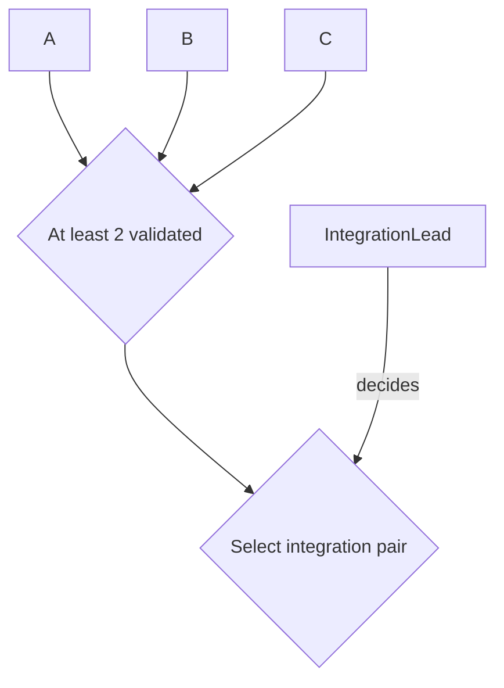

# Planning conventions

This file defines the exact current planning grammar: `plan-grammar-v2`. Agents must not infer alternate meanings from layout, color, prose tone, or prior chats.

## Grammar version

`plan-grammar-v2` is intentionally incompatible with `plan-grammar-v1` in milestone acceptance/lifecycle semantics. In v2:

- milestone delivery/evidence and milestone acceptance are separate facts;
- accepted milestones use durable acceptance records;
- milestone-source hard prerequisites become operational only when the current accepted PlanRef projects the milestone `MILESTONE_DONE` and indexes its acceptance;
- issued acceptance records are immutable historical receipts.

A historical v1 plan remains valid under v1. Do not silently reinterpret a v1 plan as v2 merely because it uses the same node names. Cross-version nesting and migration are defined in `NESTING.md`.

## Canonical node classes

### ROLE
A stable authority/responsibility slot. Roles are not holders.

### MILESTONE
An outcome with explicit acceptance criteria. Status is encoded only by class:

- `MILESTONE_PENDING`
- `MILESTONE_INPROGRESS`
- `MILESTONE_DONE`

These classes describe the state projected by the **current accepted roadmap snapshot**. They are not instantaneous claims about every external event that may have occurred since that PlanRef was accepted.

Do not put status words into milestone labels.

A Milestone definition, work performed toward it, evidence about it, acceptance of it, and the roadmap's status projection are distinct facts. Assignment means responsibility for delivery; it does not by itself grant acceptance authority.

### GATE
An objective predicate. No Role decides a Gate.

### DECISION
A judgment call. Every Decision must have exactly one incoming `decides` edge from one Role.

### DATA
A concrete evidence/artifact dependency important enough to appear in the overview. Do not use DATA nodes for ordinary documentation.

## Edge grammar

### Hard prerequisite

```text
A --> B
```

Meaning: A must be accepted/satisfied before substantive execution of B begins.

Activation is node-type-specific:

- **Milestone source:** the prerequisite is operative only when the current accepted PlanRef projects that Milestone as `MILESTONE_DONE` and indexes the valid acceptance record that supports the projection. A visible external acceptance record alone does not open downstream dispatch while the current accepted roadmap still shows the Milestone unfinished.
- **Gate source:** the prerequisite is operative when the Gate's objective predicate is demonstrably true. No separate Gate-status or Gate-projection commit is required. If the Gate counts Milestones, it counts only Milestones operative as `MILESTONE_DONE` in the current accepted PlanRef.
- **Decision or DATA source:** use the satisfaction/activation semantics explicitly defined for that node and its incoming/outgoing records. Do not infer a Milestone-style status/projection lifecycle merely from the hard-prerequisite edge.

For ordinary nodes, multiple hard incoming edges mean **AND**.

Any OR, N-of-M, threshold, or other non-AND condition requires an explicit GATE.

### Scheduling preference

```text
A -. "preferred before" .-> B
```

Meaning: B may proceed without A, but absent a specific reason otherwise, Foreman should schedule A first.

This is the only dotted scheduling phrase in the overview grammar. Do not substitute `helpful before`, `nonblocking`, `quality feedback`, `ideally before`, or similar wording.

### Role assignment

```text
Role -- "assigned to" --> Milestone
```

Meaning: the Role has primary responsibility for delivering that Milestone to its acceptance point.

Each Milestone has exactly one primary assigned Role before substantive dispatch.

Assignment does not create permissions that are absent from the Role's accepted authority record, and it does not imply that the assigned Role may accept its own delivered outcome.

### Decision authority

```text
Role -- "decides" --> Decision
```

Meaning: the Role has final responsibility for the named Decision within its accepted scope.

A Decision must have exactly one `decides` edge.

### Decision outcomes

```text
Decision -- "outcome name" --> downstream
```

Every materially distinct outgoing Decision path must be labeled with the outcome that opens it.

## Gate rules

- A Gate contains no hidden judgment.
- A Gate label must state a precise predicate.
- A Role is never `assigned to` a Gate and never `decides` a Gate.
- If a Gate requires someone to select, interpret, rank, or choose, split that judgment into a Decision node.
- A Gate does not acquire a Milestone-style status lifecycle. Its predicate is evaluated directly.
- When a Gate predicate depends on Milestones, only Milestones operative as `MILESTONE_DONE` in the current accepted PlanRef count as satisfied Milestone inputs.

Example:



`At least 2 validated` is automatic. `Select integration pair` is a Decision.

## Decision rules

- A Decision label must state the actual question/choice.
- Exactly one Role decides it.
- Consultation may be recorded elsewhere; do not add several `decides` edges.
- If two accepted records appear to grant final authority over the same decision scope, stop that decision and escalate to the nearest common parent authority.

## Milestone acceptance

Milestone acceptance is a durable decision/evidence record, not a diagram edit and not an inference from work-package completion.

A milestone contract must identify:

```text
Acceptance criteria:
Acceptance authority:
Acceptance authority source:
Evidence location:
Acceptance record index: none | <durable locator>
```

`Acceptance authority` and `Acceptance authority source` are **references to authority, not grants of authority**. Merely naming a Role in the milestone contract cannot authorize that Role to accept the milestone. The cited authority source must be independently accepted and must actually grant that Role acceptance authority over the milestone/scope. If it does not, acceptance authority is absent.

The accepting authority may be the same Role as the primary assigned Role only when an independently accepted authority source explicitly permits that arrangement. Do not infer self-acceptance from assignment.

### Contract PlanRef versus projection PlanRef

Acceptance always targets the exact accepted plan revision that contains the contract being judged.

Use this sequence:

```text
contract_plan_ref
    = exact accepted pre-acceptance PlanRef containing the milestone outcome,
      criteria, and authority references being judged

acceptance record
    = binds that exact contract_plan_ref + accepted evidence + accepting authority

later roadmap/status projection
    = creates a new PlanRef that marks MILESTONE_DONE and populates
      the Acceptance record index
```

The later projection PlanRef is **not** the contract revision that was accepted merely because it records `MILESTONE_DONE` or links the acceptance record. It is a later projection of the already-durable acceptance. The projection does not re-accept the milestone; it makes the accepted fact operative in the current roadmap.

`Acceptance record index` is projection/index metadata. It may remain `none` in the `contract_plan_ref` and be populated only after the acceptance record exists. Populating it later changes the repository PlanRef but does not change which earlier contract revision the acceptance judged.

Until that later projection PlanRef itself is accepted, Foreman and other agents must continue to use the current accepted roadmap state. They must not open downstream **Milestone** hard-prerequisite dispatch merely because they can see an acceptance record that the current PlanRef has not yet projected.

If the milestone outcome, acceptance criteria, or authority semantics change materially, the new contract revision requires its own acceptance; an old acceptance record cannot silently migrate to the new contract.

A milestone acceptance record should bind at least:

```text
milestone_id
plan_id
contract_plan_ref
accepted_by_role
acceptance_authority_source
accepted_evidence
accepted_at
limitations_or_residuals
```

The acceptance record certifies only the stated milestone outcome under its criteria and evidence. It does not imply that every attempted work package succeeded, that every proposed implementation step was necessary, or that unrelated downstream milestones are accepted.

### Acceptance history is immutable

Once issued, an acceptance record is an immutable historical receipt. Do not edit, retarget, weaken, strengthen, or reinterpret it in place.

If an acceptance record was erroneous or must be replaced, create a new durable record that explicitly references or supersedes the prior one under valid authority. If later evidence invalidates an otherwise historical acceptance for current planning, retain the old acceptance unchanged, record a separate revocation/reopening/correction decision, and project the resulting current state through an accepted plan change.

Historical truth and current operational status are therefore separate:

```text
"Acceptance A was issued under contract_plan_ref X"
    !=
"Milestone M currently counts as done in the accepted roadmap"
```

Use `templates/MILESTONE_ACCEPTANCE.md` for the durable record.

### Lightweight projection example

The v2 separation does **not** require a second milestone-acceptance judgment merely to update the roadmap.

```text
P1 = current accepted PlanRef
     M1 is INPROGRESS
     Acceptance record index: none

AcceptanceRole, already authorized to accept M1,
issues immutable acceptance record A against P1.

PlannerRole, already authorized to publish the relevant plan change,
publishes a mechanical status/index projection:
     M1 -> MILESTONE_DONE
     Acceptance record index -> A

P2 = that projection after it is accepted as the new PlanRef.
Only now does M1 open downstream Milestone hard prerequisites.
```

`PlannerRole` and `AcceptanceRole` are example labels, not required role names. The same underlying holder may occupy both if independently authorized. Foreman may coordinate/route the projection, but Foreman gains neither milestone-acceptance authority nor plan-publication authority merely because the update is mechanical.

## Stable IDs

Node IDs are durable identifiers. Display labels may change without changing node identity when the underlying Role/Milestone/Gate/Decision remains the same.

Do not reuse a retired stable ID for a different semantic object.

## Visual class definitions

Use these class definitions unless the grammar itself is intentionally versioned:

```mermaid
classDef ROLE fill:whitesmoke,stroke:slategray,stroke-width:15px,color:black,font-weight:600,font-size:16px,rx:8,ry:8;
classDef GATE fill:aliceblue,stroke:deepskyblue,stroke-width:1.5px,color:navy,font-weight:700,font-size:14px,rx:12,ry:12;
classDef DECISION fill:lightyellow,stroke:darkorange,stroke-width:1.5px,color:darkgoldenrod,font-weight:700,font-size:14px,rx:12,ry:12;
classDef DATA fill:mistyrose,stroke:red,stroke-width:1.5px,color:darkred,font-weight:700,font-size:14px,rx:12,ry:12;
classDef MILESTONE_DONE fill:honeydew,stroke:forestgreen,stroke-width:1.5px,color:darkgreen,font-weight:900,font-size:14px,rx:8,ry:8;
classDef MILESTONE_INPROGRESS fill:lavender,stroke:purple,stroke-width:1.8px,color:indigo,font-weight:700,font-size:14px,rx:10,ry:10;
classDef MILESTONE_PENDING fill:gainsboro,stroke:dimgray,stroke-width:1.5px,color:black,font-weight:600,font-size:14px,rx:8,ry:8;
```

## Overview scope

The overview roadmap answers only:

- what outcomes are planned;
- what blocks what;
- what is merely preferred earlier;
- what objective gates exist;
- what explicit decisions exist;
- which Role owns each milestone/decision;
- current milestone status.

Do not put handoff machinery, polling, reviewer trees, chat names, or detailed internal task breakdown into the top-level overview unless they materially change the big-picture plan.

## Milestone wording

Milestones describe outcomes, not activities.

Prefer:

```text
M3: Multimodal session review available
```

Avoid:

```text
M3: Review multimodal session
```

Activity detail belongs in the milestone record or child plan.

## Status rules

- Every Milestone has exactly one status class in the current accepted roadmap.
- Status classes describe the state projected by the **current accepted PlanRef**, not every external event that may have occurred after that PlanRef was accepted.
- `DONE` means the current accepted PlanRef projects a durable accepted milestone record and indexes that record; the class does not itself create acceptance.
- `INPROGRESS` means the current accepted roadmap projects substantive execution as active.
- `PENDING` means the current accepted roadmap projects the Milestone as neither done nor currently active.
- During the intentionally permitted interval after a durable acceptance record is issued but before its status/index projection is accepted, the displayed class remains whatever the current accepted PlanRef already says. No fourth status exists for this interval.
- A diagram edit cannot make a milestone complete without the required acceptance evidence and accepting authority.
- A status-only roadmap update must link the acceptance record that justifies the projection.
- The PlanRef created by that status/index update does not replace the acceptance record's `contract_plan_ref`.
- Until the status/index projection itself is accepted as the current PlanRef, downstream Milestone hard-prerequisite dispatch remains governed by the prior current roadmap state.

## Plan changes

Semantic plan changes must use normal version-controlled review and must state:

```text
Semantic delta:
Affected milestones:
Affected roles:
Active work impact: none | continue | pause | redirect | supersede
Authority impact: none | binding change | scope change
Foreman dispatch required:
Controlling decision/evidence:
```

A status-only update may be shorter but must link the acceptance evidence.

The exact accepted Git commit containing the change becomes the new PlanRef.

## Propagation

Plan propagation is event-driven, with Foreman boundary checks as a backstop.

After a semantic plan/role change is accepted, Foreman receives the exact PlanRef and delta, then routes only the relevant change to affected work packages. Unaffected work does not restart.

Foreman rechecks planning state before new substantive dispatch, materially resumed work, and final readiness/merge/acceptance handoffs whose validity depends on the plan.

## Grammar changes

Do not add a new node class, arrow type, arrow label, or hidden semantic convention by example alone.

First revise this file and explicitly version the grammar if the change is incompatible with prior plans.
