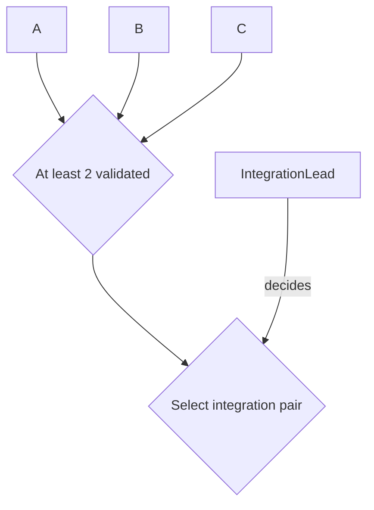

# Planning conventions

This file defines the exact planning grammar. Agents must not infer alternate meanings from layout, color, prose tone, or prior chats.

## Canonical node classes

### ROLE
A stable authority/responsibility slot. Roles are not holders.

### MILESTONE
An outcome with explicit acceptance criteria. Status is encoded only by class:

- `MILESTONE_PENDING`
- `MILESTONE_INPROGRESS`
- `MILESTONE_DONE`

Do not put status words into milestone labels.

### GATE
An objective predicate. No Role decides a Gate.

### DECISION
A judgment call. Every Decision must have exactly one incoming `decides` edge from one Role.

### DATA
A concrete evidence/artifact dependency important enough to appear in the overview. Do not use DATA nodes for ordinary documentation.

## Edge grammar

### Hard prerequisite

```text
A --> B
```

Meaning: A must be accepted/satisfied before substantive execution of B begins.

For ordinary nodes, multiple hard incoming edges mean **AND**.

Any OR, N-of-M, threshold, or other non-AND condition requires an explicit GATE.

### Scheduling preference

```text
A -. "preferred before" .-> B
```

Meaning: B may proceed without A, but absent a specific reason otherwise, Foreman should schedule A first.

This is the only dotted scheduling phrase in the overview grammar. Do not substitute `helpful before`, `nonblocking`, `quality feedback`, `ideally before`, or similar wording.

### Role assignment

```text
Role -- "assigned to" --> Milestone
```

Meaning: the Role has primary responsibility for delivering that Milestone to its acceptance point.

Each Milestone has exactly one primary assigned Role before substantive dispatch.

Assignment does not create permissions that are absent from the Role's accepted authority record.

### Decision authority

```text
Role -- "decides" --> Decision
```

Meaning: the Role has final responsibility for the named Decision within its accepted scope.

A Decision must have exactly one `decides` edge.

### Decision outcomes

```text
Decision -- "outcome name" --> downstream
```

Every materially distinct outgoing Decision path must be labeled with the outcome that opens it.

## Gate rules

- A Gate contains no hidden judgment.
- A Gate label must state a precise predicate.
- A Role is never `assigned to` a Gate and never `decides` a Gate.
- If a Gate requires someone to select, interpret, rank, or choose, split that judgment into a Decision node.

Example:



`At least 2 validated` is automatic. `Select integration pair` is a Decision.

## Decision rules

- A Decision label must state the actual question/choice.
- Exactly one Role decides it.
- Consultation may be recorded elsewhere; do not add several `decides` edges.
- If two accepted records appear to grant final authority over the same decision scope, stop that decision and escalate to the nearest common parent authority.

## Stable IDs

Node IDs are durable identifiers. Display labels may change without changing node identity when the underlying Role/Milestone/Gate/Decision remains the same.

Do not reuse a retired stable ID for a different semantic object.

## Visual class definitions

Use these class definitions unless the grammar itself is intentionally versioned:

```mermaid
classDef ROLE fill:whitesmoke,stroke:slategray,stroke-width:15px,color:black,font-weight:600,font-size:16px,rx:8,ry:8;
classDef GATE fill:aliceblue,stroke:deepskyblue,stroke-width:1.5px,color:navy,font-weight:700,font-size:14px,rx:12,ry:12;
classDef DECISION fill:lightyellow,stroke:darkorange,stroke-width:1.5px,color:darkgoldenrod,font-weight:700,font-size:14px,rx:12,ry:12;
classDef DATA fill:mistyrose,stroke:red,stroke-width:1.5px,color:darkred,font-weight:700,font-size:14px,rx:12,ry:12;
classDef MILESTONE_DONE fill:honeydew,stroke:forestgreen,stroke-width:1.5px,color:darkgreen,font-weight:900,font-size:14px,rx:8,ry:8;
classDef MILESTONE_INPROGRESS fill:lavender,stroke:purple,stroke-width:1.8px,color:indigo,font-weight:700,font-size:14px,rx:10,ry:10;
classDef MILESTONE_PENDING fill:gainsboro,stroke:dimgray,stroke-width:1.5px,color:black,font-weight:600,font-size:14px,rx:8,ry:8;
```

## Overview scope

The overview roadmap answers only:

- what outcomes are planned;
- what blocks what;
- what is merely preferred earlier;
- what objective gates exist;
- what explicit decisions exist;
- which Role owns each milestone/decision;
- current milestone status.

Do not put handoff machinery, polling, reviewer trees, chat names, or detailed internal task breakdown into the top-level overview unless they materially change the big-picture plan.

## Milestone wording

Milestones describe outcomes, not activities.

Prefer:

```text
M3: Multimodal session review available
```

Avoid:

```text
M3: Review multimodal session
```

Activity detail belongs in the milestone record or child plan.

## Status rules

- Every Milestone has exactly one status class.
- `DONE` requires accepted evidence under the proper authority.
- `INPROGRESS` means substantive execution is active.
- `PENDING` means not accepted and not currently active.
- A diagram edit cannot make a milestone complete without the required acceptance evidence.

## Plan changes

Semantic plan changes must use normal version-controlled review and must state:

```text
Semantic delta:
Affected milestones:
Affected roles:
Active work impact: none | continue | pause | redirect | supersede
Authority impact: none | binding change | scope change
Foreman dispatch required:
Controlling decision/evidence:
```

A status-only update may be shorter but must link the acceptance evidence.

The exact accepted Git commit containing the change becomes the new PlanRef.

## Propagation

Plan propagation is event-driven, with Foreman boundary checks as a backstop.

After a semantic plan/role change is accepted, Foreman receives the exact PlanRef and delta, then routes only the relevant change to affected work packages. Unaffected work does not restart.

Foreman rechecks planning state before new substantive dispatch, materially resumed work, and final readiness/merge/acceptance handoffs whose validity depends on the plan.

## Grammar changes

Do not add a new node class, arrow type, arrow label, or hidden semantic convention by example alone.

First revise this file and explicitly version the grammar if the change is incompatible with prior plans.
