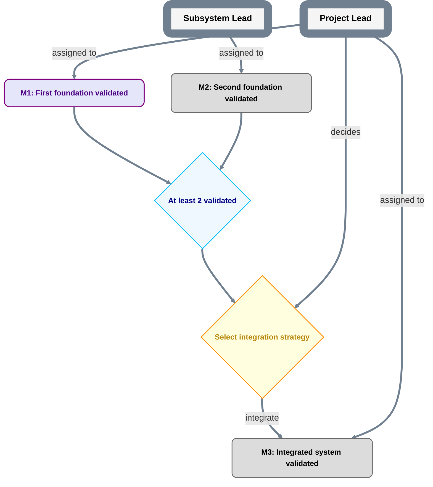

# Project plan

```text
plan_id: <replace-with-stable-PlanID>
grammar: plan-grammar-v1
```

This file is the canonical at-a-glance roadmap for the project. Replace all angle-bracket placeholders before treating it as operational.

Interpret this diagram only under `CONVENTIONS.md`. Current holder/authority bindings are in `ROLES.md`. Parent scope, if any, is in `PARENT.md`.



## Milestone contracts

For each milestone, maintain a durable record containing at least:

```text
MilestoneID:
Outcome:
Acceptance criteria:
Primary assigned Role:
Authority source:
Evidence location:
Child plan: none | <internal path> | <external repository locator>
```

The Mermaid overview should remain terse. Put detailed acceptance criteria in milestone records, issues, or child plans rather than inside nodes.
