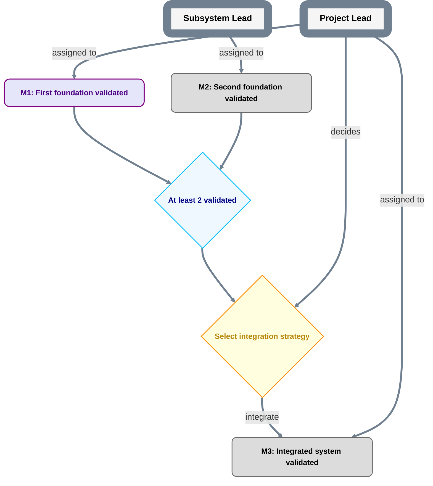

# Project plan

```text
plan_id: <replace-with-stable-PlanID>
grammar: plan-grammar-v2
reference_contract: qualified-reference-v1
repository_identity: {scheme: github-repository-id-v1, authority: <GitHub host>, id: <numeric repository ID>}
repository_locator: <readable owner/repo or URL>
```

This file is the canonical at-a-glance roadmap for the project. Replace all angle-bracket placeholders before treating it as operational.

This proposed reference-contract declaration becomes operative only through accepted publication. Existing plans explicitly migrate under `REFERENCES.md`; local nodes inherit this plan's repository/PlanID context, while cross-plan references use full qualified identities and separate exact revisions.

Interpret this diagram only under `CONVENTIONS.md`. Current holder/authority bindings are in `ROLES.md`. Parent scope, if any, is in `PARENT.md`.



## Milestone contracts

For each milestone, maintain a durable record containing at least:

```text
MilestoneID:
Outcome:
Acceptance criteria:
Primary assigned Role:
Assignment authority source:
Acceptance authority:
Acceptance authority source:
Evidence location:
Execution/status evidence: <initial PENDING basis or authorized execution/reopening event>
Acceptance record index: none | <durable locator>
Acceptance history: <prior receipts and reopening decisions or none>
Child plan: none | <internal path> | <external repository locator>
```

The primary assigned Role is responsible for delivery; it is not automatically the accepting authority. The same Role may perform both functions only when an independently accepted authority source explicitly grants both scopes.

The milestone's `Acceptance authority` field only references authority; it does not create it. If the named Role lacks an independently accepted authority source covering this milestone/scope, acceptance authority is absent.

`Acceptance record index` is projection/index metadata. In the exact pre-acceptance `contract_plan_ref` it will normally be `none`. After a durable acceptance record exists, a later status/index update may populate the locator and mark the node `MILESTONE_DONE`; that later commit has a different PlanRef and does not become the contract revision that was accepted.

`MILESTONE_DONE` is a roadmap projection of a durable milestone acceptance record. The class does not itself create acceptance. Use `templates/MILESTONE_ACCEPTANCE.md` for the acceptance record.

Starting, pausing and resuming use the transition-specific execution evidence in `CONVENTIONS.md`, without fabricated acceptance. Reopening DONE requires an authorized reopening/revocation/correction decision; clear the current operative index while preserving the old receipt in history. A direct reopening to INPROGRESS also cites the authorized start/resume event.

The Mermaid overview should remain terse. Put detailed acceptance criteria, evidence, and acceptance records in durable records rather than inside nodes.

## Decision and DATA contract index

For each Decision/DATA node, index its exact accepted definition here. New plans should explicitly adopt the versioned contracts in `NODE_CONTRACTS.md`; legacy nodes retain their own explicit semantics until accepted migration.

| Node ID | Kind | Declared node contract | Definition locator in this PlanRef |
|---|---|---|---|
| `<DecisionID>` | `DECISION` | `decision-result-v1` | `<definition path>` |
| `<DataID>` | `DATA` | `data-dependency-v1` | `<definition path>` |

Use `templates/DECISION.md` / `templates/DECISION_RESULT.md` and `templates/DATA.md` / `templates/DATA_RESOLUTION.md`. Each definition carries its sole current result/resolution index and retained history. An immutable record existing outside that accepted index does not open a branch or satisfy DATA. These placeholders are not operative node records.
