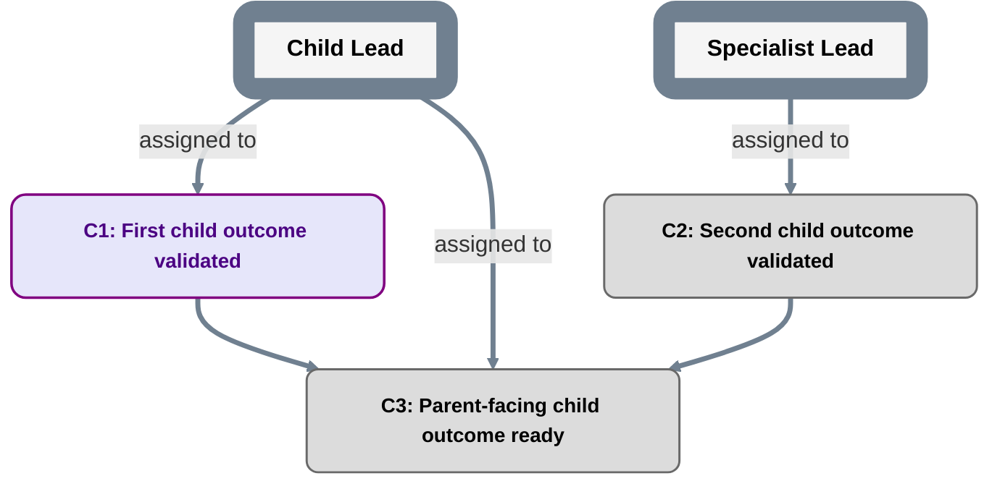

# Child plan template

Fill every semantic header field before substantive dispatch. Complete the separate navigation locator for the human-facing roadmap; it supplies no dispatch authority.

Child managed execution also requires current accepted `transition-action-v1` configuration and a valid reconciled adoption/legacy baseline under `planning/EXECUTION.md` -> **Operational eligibility**. A first child publication choosing `none` stays no-dispatch until later valid adoption; a parent grant or an empty inventory does not waive this boundary.

```text
plan_id: <stable PlanID>
grammar: plan-grammar-v2
reference_contract: qualified-reference-v1
repository_identity: {scheme: github-repository-id-v1, authority: <GitHub host>, id: <numeric repository ID>}
repository_locator: <readable owner/repo or URL>
parent_plan: <qualified parent plan reference>
parent_plan_navigation_locator: <human-facing relative path or URL to the parent PLAN.md; not authority>
parent_plan_ref: <exact accepted parent relationship PlanRef containing the bound contract>
parent_milestone: <qualified parent milestone reference>
scope_owner_role: <exact RoleID>
parent_contract: <qualified parent contract reference>
parent_contract_locator: <durable path/link at parent_plan_ref>
```

This child plan implements the parent milestone. It does not redefine it.

Use `planning/REFERENCES.md` for full qualified tuples and explicit accepted adoption/migration. The header fixes the context of local child nodes/Roles; parent and other cross-plan objects require full qualification. Readable locators do not identify authority.

The child pin is learned after the parent relationship is accepted. It differs from the parent contract's prior `authority_baseline_plan_ref`; do not insert the child's own future SHA or require mutual containing-SHA pointers. Follow `planning/REFERENCES.md` for creation and subsequent current-parent checks.

Replace the parent navigation placeholder below with `↑ [Parent plan](<locator>)` using the header's exact target before publishing this view. It is separate from the accepted relationship pin and contract locator; no Mermaid click is required.

↑ Parent plan: `<parent_plan_navigation_locator — nonoperational placeholder>`



## Navigation

Populate one visible row per navigable child node under `planning/CONVENTIONS.md` -> **Human navigation**. Use existing Milestone `Child plan` fields and Decision/DATA definition locators, adjusting relative paths from this roadmap. Omit nodes without targets; replace this nonoperational placeholder row with actual stable IDs and Markdown links. The parent link above the diagram is sufficient for upward navigation.

| Node | Relation | Go to |
|---|---|---|
| `<MilestoneID / DecisionID / DataID>` | `<child plan / details / data details>` | `<Markdown link derived from the existing source locator>` |

## Parent-facing invariant

Internal child changes are allowed only when all of these remain unchanged:

```text
parent milestone identity
parent required outcome
parent acceptance criteria
parent dependencies/scheduling semantics
delegated authority boundary
shared contracts owned above this child
```

If any item must change, stop treating the change as internal and escalate to the parent authority.

## Child milestone records

For each child milestone maintain:

```text
MilestoneID:
Outcome:
Acceptance criteria:
Primary assigned Role:
Assignment authority source:
Acceptance authority:
Acceptance authority source:
Evidence location:
Execution/status evidence: <initial PENDING basis or authorized execution/reopening event>
Acceptance record index: none | <durable locator>
Acceptance history: <prior receipts and reopening decisions or none>
Child plan: none | <internal path> | <external repository locator>
```

Assignment is responsibility for delivery, not implicit authority to accept the delivered outcome. Naming an `Acceptance authority` Role does not grant that authority; the cited authority source must be independently accepted and cover the child milestone/scope.

The pre-acceptance `contract_plan_ref` normally has `Acceptance record index: none`. After a durable acceptance record exists, a later child-plan status/index commit may populate the locator and project `MILESTONE_DONE`. That later PlanRef is not the contract revision judged by the acceptance record.

Use `templates/MILESTONE_ACCEPTANCE.md` for durable child milestone acceptance.

Use the same transition-specific rules in `planning/CONVENTIONS.md` for child Milestones: start/pause/resume cite authorized execution events without fabricated acceptance; reopening DONE cites an authorized reopening/revocation/correction decision, clears the current operative index, and preserves the old receipt/history. Direct reopening to INPROGRESS also needs authorized start/resume evidence. None of these changes weaken the parent contract or grant parent acceptance authority.

## Child Decision and DATA contract index

Index every child Decision/DATA definition, including its explicitly adopted version under `planning/NODE_CONTRACTS.md`.

| Node ID | Kind | Declared node contract | Definition locator in this child PlanRef |
|---|---|---|---|
| `<DecisionID>` | `DECISION` | `decision-result-v1` | `<definition path>` |
| `<DataID>` | `DATA` | `data-dependency-v1` | `<definition path>` |

Use `templates/DECISION.md` / `templates/DECISION_RESULT.md` and `templates/DATA.md` / `templates/DATA_RESOLUTION.md`. The current accepted child PlanRef indexes its operative records; shared roadmap syntax does not grant support for unknown node-contract versions. Keep the actual parent boundary and authority unchanged, and use an explicit accepted migration for legacy node semantics.
