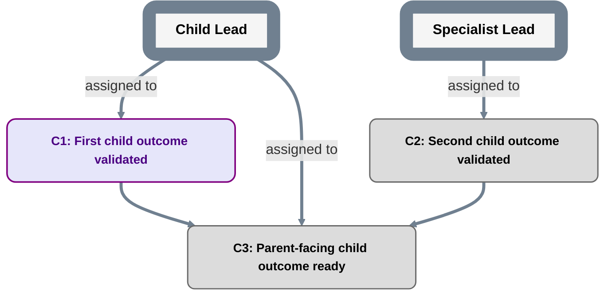

# Child plan template

Fill every header field before substantive dispatch.

```text
plan_id: <stable PlanID>
grammar: plan-grammar-v2
parent_plan: <parent PlanID or external locator>
parent_plan_ref: <exact accepted parent PlanRef>
parent_milestone: <exact parent MilestoneID>
scope_owner_role: <exact RoleID>
parent_contract: <durable path/link>
```

This child plan implements the parent milestone. It does not redefine it.



## Parent-facing invariant

Internal child changes are allowed only when all of these remain unchanged:

```text
parent milestone identity
parent required outcome
parent acceptance criteria
parent dependencies/scheduling semantics
delegated authority boundary
shared contracts owned above this child
```

If any item must change, stop treating the change as internal and escalate to the parent authority.

## Child milestone records

For each child milestone maintain:

```text
MilestoneID:
Outcome:
Acceptance criteria:
Primary assigned Role:
Assignment authority source:
Acceptance authority:
Acceptance authority source:
Evidence location:
Execution/status evidence: <initial PENDING basis or authorized execution/reopening event>
Acceptance record index: none | <durable locator>
Acceptance history: <prior receipts and reopening decisions or none>
```

Assignment is responsibility for delivery, not implicit authority to accept the delivered outcome. Naming an `Acceptance authority` Role does not grant that authority; the cited authority source must be independently accepted and cover the child milestone/scope.

The pre-acceptance `contract_plan_ref` normally has `Acceptance record index: none`. After a durable acceptance record exists, a later child-plan status/index commit may populate the locator and project `MILESTONE_DONE`. That later PlanRef is not the contract revision judged by the acceptance record.

Use `templates/MILESTONE_ACCEPTANCE.md` for durable child milestone acceptance.

Use the same transition-specific rules in `planning/CONVENTIONS.md` for child Milestones: start/pause/resume cite authorized execution events without fabricated acceptance; reopening DONE cites an authorized reopening/revocation/correction decision, clears the current operative index, and preserves the old receipt/history. Direct reopening to INPROGRESS also needs authorized start/resume evidence. None of these changes weaken the parent contract or grant parent acceptance authority.

## Child Decision and DATA contract index

Index every child Decision/DATA definition, including its explicitly adopted version under `planning/NODE_CONTRACTS.md`.

| Node ID | Kind | Declared node contract | Definition locator in this child PlanRef |
|---|---|---|---|
| `<DecisionID>` | `DECISION` | `decision-result-v1` | `<definition path>` |
| `<DataID>` | `DATA` | `data-dependency-v1` | `<definition path>` |

Use `templates/DECISION.md` / `templates/DECISION_RESULT.md` and `templates/DATA.md` / `templates/DATA_RESOLUTION.md`. The current accepted child PlanRef indexes its operative records; shared roadmap syntax does not grant support for unknown node-contract versions. Keep the actual parent boundary and authority unchanged, and use an explicit accepted migration for legacy node semantics.
