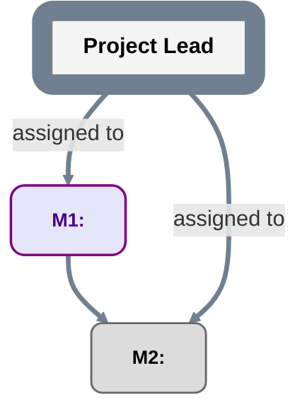

# Root plan template

Copy this structure into `planning/PLAN.md` and replace all placeholders.

```text
plan_id: <stable PlanID>
grammar: plan-grammar-v2
reference_contract: qualified-reference-v1
repository_identity: {scheme: github-repository-id-v1, authority: <GitHub host>, id: <numeric repository ID>}
repository_locator: <readable owner/repo or URL>
```

The reference declaration requires explicit accepted adoption under `planning/REFERENCES.md`. Local nodes inherit the header's repository/PlanID; cross-plan references use full qualified identities with exact revisions bound separately. Placeholders and proposed adoption are not operational authority.



For each milestone maintain a durable record containing at least:

```text
MilestoneID:
Outcome:
Acceptance criteria:
Primary assigned Role:
Assignment authority source:
Acceptance authority:
Acceptance authority source:
Evidence location:
Execution/status evidence: <initial PENDING basis or authorized execution/reopening event>
Acceptance record index: none | <durable locator>
Acceptance history: <prior receipts and reopening decisions or none>
Child plan: none | <internal path> | <external repository locator>
```

The primary assigned Role delivers the milestone; it is not automatically the authority that accepts it. Naming an `Acceptance authority` Role does not grant that authority; the cited source must be independently accepted and cover the milestone/scope.

`Acceptance record index` is projection metadata. The pre-acceptance `contract_plan_ref` normally contains `none`; after acceptance, a later plan/status commit may populate the locator and mark the node `MILESTONE_DONE`. That later PlanRef does not replace the acceptance record's `contract_plan_ref`.

`MILESTONE_DONE` is only a projection of a durable acceptance record. Use `templates/MILESTONE_ACCEPTANCE.md`.

Use the transition-specific evidence in `planning/CONVENTIONS.md`: start/pause/resume cite authorized execution events without fabricated acceptance; reopening DONE cites an authorized reopening/revocation/correction decision, clears the current operative index, and preserves the old receipt/history. Direct reopening to INPROGRESS also needs authorized start/resume evidence.

Do not add custom edge semantics without first updating `planning/CONVENTIONS.md`.

## Decision and DATA contract index

Index every Decision/DATA definition used by this plan. Explicitly adopt its version under `planning/NODE_CONTRACTS.md`; do not infer it from `plan-grammar-v2` alone.

| Node ID | Kind | Declared node contract | Definition locator in this PlanRef |
|---|---|---|---|
| `<DecisionID>` | `DECISION` | `decision-result-v1` | `<definition path>` |
| `<DataID>` | `DATA` | `data-dependency-v1` | `<definition path>` |

Create definitions/results with `templates/DECISION.md` and `templates/DECISION_RESULT.md`; create DATA definitions/resolutions with `templates/DATA.md` and `templates/DATA_RESOLUTION.md`. The definition's current index selects the exact immutable operative record. Publication changes selection; record/artifact existence alone cannot. Preserve history and explicit branch/consumer work disposition on replacement/revocation/withdrawal.
